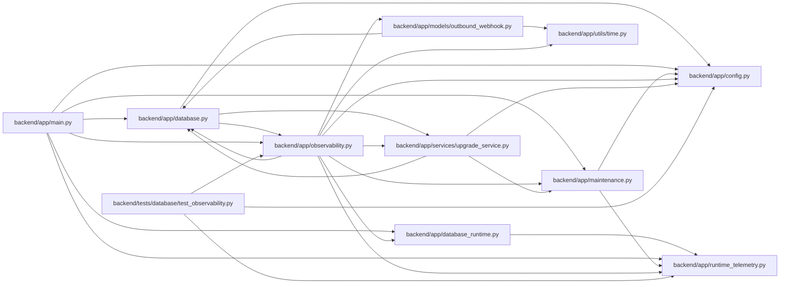

# observability Module

**Path:** `backend/app/observability.py`

## Description

Database-backed readiness, drain state, and low-cardinality instrumentation.

## Imports

| Source | Symbols |
|--------|---------|
| `__future__` | `annotations` |
| `app.config` | `get_settings` |
| `app.database` | `async_session_maker`, `database_runtime_summary` |
| `app.database_runtime` | `classify_database_failure` |
| `app.maintenance` | `maintenance_state` |
| `app.models.outbound_webhook` | `OutboundWebhookDelivery`, `OutboundWebhookDeliveryStatus` |
| `app.runtime_telemetry` | `activity`, `correlation_id_context`, `metrics` |
| `app.services.upgrade_service` | `head_revision` |
| `app.utils.time` | `as_utc`, `utc_now` |
| `asyncio` | `asyncio` |
| `datetime` | `datetime` |
| `logging` | `logging` |
| `pathlib` | `Path` |
| `sqlalchemy` | `event`, `func`, `or_`, `select`, `text` |
| `sqlalchemy.engine` | `Engine` |
| `sqlalchemy.exc` | `SQLAlchemyError` |
| `sqlalchemy.ext.asyncio` | `AsyncEngine`, `AsyncSession` |
| `time` | `monotonic` |
| `typing` | `Any` |

## Local dependency map

<!-- Auto-generated local dependency summary. Do not edit by hand. -->

### Internal neighbors

| Direction | Module |
|---|---|
| Inbound | [app_database](../modules/app_database.md) |
| Inbound | [app_main](../modules/app_main.md) |
| Inbound | [test_observability](../modules/test_observability.md) |
| Outbound | [config](../modules/config.md) |
| Outbound | [app_database](../modules/app_database.md) |
| Outbound | [database_runtime](../modules/database_runtime.md) |
| Outbound | [maintenance](../modules/maintenance.md) |
| Outbound | [models_outbound_webhook](../modules/models_outbound_webhook.md) |
| Outbound | [runtime_telemetry](../modules/runtime_telemetry.md) |
| Outbound | [upgrade_service](../modules/upgrade_service.md) |
| Outbound | [time](../modules/time.md) |

### External packages

| Language | Used packages | Undeclared packages |
|---|---:|---:|
| python | 1 | 0 |

## Functions

| Function | Signature | Decorators | Description |
|----------|-----------|------------|-------------|
| `_query_operation` | `(statement: str) -> str` | — | — |
| `install_database_instrumentation` | `(async_engine: AsyncEngine) -> None` | — | Attach one credential/parameter-free instrumentation set to an engine. |
| `_resident_set_size_bytes` | `() -> int \| None` | — | Read current Linux RSS without introducing a monitoring dependency. |
| `_queue_snapshot` | *(async)* `(db: AsyncSession) -> dict[str, Any]` | — | — |
| `_postgresql_snapshot` | *(async)* `(db: AsyncSession) -> dict[str, Any]` | — | — |
| `readiness_snapshot` | *(async)* `() -> tuple[bool, dict[str, Any]]` | — | Check connectivity, a short query, schema head, and drain evidence. |
| `collect_metrics` | *(async)* `() -> None` | — | Refresh database/queue gauges for a scrape without failing the scrape. |
