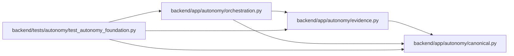

# orchestration Module

**Path:** `backend/app/autonomy/orchestration.py`

## Description

External-journal-first DAG and fenced verification state machines.

## Imports

| Source | Symbols |
|--------|---------|
| `__future__` | `annotations` |
| `app.autonomy.canonical` | `StrictContractModel`, `canonical_json_bytes`, `sha256_hex` |
| `app.autonomy.evidence` | `ZERO_DIGEST` |
| `collections.abc` | `Callable` |
| `datetime` | `UTC`, `datetime` |
| `enum` | `StrEnum` |
| `pydantic` | `Field`, `field_validator`, `model_validator` |
| `typing` | `Literal`, `Protocol`, `runtime_checkable` |

## Local dependency map

<!-- Auto-generated local dependency summary. Do not edit by hand. -->

### Internal neighbors

| Direction | Module |
|---|---|
| Inbound | [test_autonomy_foundation](../modules/test_autonomy_foundation.md) |
| Outbound | [autonomy_canonical](../modules/autonomy_canonical.md) |
| Outbound | [evidence](../modules/evidence.md) |

### External packages

| Language | Used packages | Undeclared packages |
|---|---:|---:|
| python | 1 | 0 |

## Classes

| Class | Kind | Line | Bases / Target | Description |
|-------|------|------|----------------|-------------|
| [DagNodeState](../entities/DagNodeState.md) | Enum | 20 | `StrEnum` | — |
| [DagNodeSpec](../entities/DagNodeSpec.md) | Pydantic model | 41 | `StrictContractModel` | — |
| [AutonomousDagContract](../entities/AutonomousDagContract.md) | Pydantic model | 67 | `StrictContractModel` | — |
| [DagJournalEntry](../entities/DagJournalEntry.md) | Pydantic model | 108 | `StrictContractModel` | — |
| [DagJournalSnapshot](../entities/DagJournalSnapshot.md) | Pydantic model | 141 | `StrictContractModel` | — |
| [ExternalDagJournal](../entities/ExternalDagJournal.md) | Class | 148 | `Protocol` | CAS state service deployed outside the WorkChord database/runtime. |
| [DagStateConflict](../entities/DagStateConflict.md) | Class | 163 | `RuntimeError` | — |
| [DagController](../entities/DagController.md) | Class | 211 | — | Commit authoritative state externally before any WorkChord projection. |
| [VerificationRequirementState](../entities/VerificationRequirementState.md) | Enum | 413 | `StrEnum` | — |
| [VerificationRequirementContract](../entities/VerificationRequirementContract.md) | Pydantic model | 423 | `StrictContractModel` | — |
| [WorkPackageContract](../entities/WorkPackageContract.md) | Pydantic model | 440 | `StrictContractModel` | — |

## Functions

| Function | Signature | Decorators | Description |
|----------|-----------|------------|-------------|
| `aggregate_work_package` | `(contract: WorkPackageContract, states: dict[str, VerificationRequirementState]) -> Literal['evaluating', 'passed', 'rework_required']` | — | Derive package state without rewriting the execution task. |
