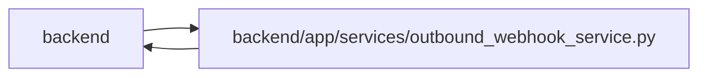

# outbound_webhook_service Module

**Path:** `backend/app/services/outbound_webhook_service.py`

## Description

Outbound webhook target management and delivery service.

## Imports

| Source | Symbols |
|--------|---------|
| `app.database` | `async_session_maker` |
| `app.database_runtime` | `run_database_retry` |
| `app.maintenance` | `require_background_writes_enabled` |
| `app.models.outbound_webhook` | `OutboundDeliveryChannel`, `OutboundWebhookDelivery`, `OutboundWebhookDeliveryStatus`, `OutboundWebhookEvent`, `OutboundWebhookTarget` |
| `app.runtime_telemetry` | `activity`, `metrics` |
| `app.schemas.outbound_webhook` | `OutboundWebhookDeliveryResponse`, `OutboundWebhookRetryResponse`, `OutboundWebhookTargetCreate`, `OutboundWebhookTargetResponse`, `OutboundWebhookTargetUpdate` |
| `app.services.email_settings_service` | `EmailSettingsService` |
| `app.services.notification_service` | `NotificationService` |
| `app.utils.time` | `as_utc`, `utc_now` |
| `app.utils.url_policy` | `URLPolicyError`, `normalize_external_http_url` |
| `asyncio` | `asyncio` |
| `datetime` | `date`, `datetime`, `timedelta` |
| `enum` | `Enum` |
| `hashlib` | `hashlib` |
| `hmac` | `hmac` |
| `httpx` | `httpx` |
| `json` | `json` |
| `logging` | `logging` |
| `sqlalchemy` | `or_`, `select`, `update` |
| `sqlalchemy.ext.asyncio` | `AsyncSession` |
| `sqlalchemy.orm` | `selectinload` |
| `typing` | `Any`, `Optional`, `Sequence` |
| `uuid` | `uuid4` |

## Local dependency map

<!-- Auto-generated local dependency summary. Do not edit by hand. -->

> Module-level dependencies exceed the generated-diagram limits, so the diagram and table below group them by top-level package. Counts report the number of module neighbors in each package.

### Internal neighbors

| Direction | Module |
|---|---|
| Inbound | `backend` (14) |
| Outbound | `backend` (10) |

### External packages

| Language | Used packages | Undeclared packages |
|---|---:|---:|
| python | 2 | 0 |

> All 24 module neighbor(s) are summarized by package because the module-level view exceeds the 12-node limit.

## Classes

| Class | Line | Bases | Description |
|-------|------|-------|-------------|
| [OutboundWebhookValidationError](../entities/OutboundWebhookValidationError.md) | 132 | `ValueError` | Raised when outbound webhook input is invalid. |
| [OutboundWebhookNotFoundError](../entities/OutboundWebhookNotFoundError.md) | 136 | `LookupError` | Raised when an outbound webhook target or delivery cannot be found. |
| [OutboundDeliveryAttemptError](../entities/OutboundDeliveryAttemptError.md) | 140 | `RuntimeError` | Classify a transport failure as retryable or terminal. |
| [OutboundWebhookService](../entities/OutboundWebhookService.md) | 148 | — | Manage outbound webhook targets and deliver matching domain events. |

## Functions

| Function | Signature | Decorators | Description |
|----------|-----------|------------|-------------|
| `run_due_outbound_delivery_jobs` | *(async)* `(*, limit: int = 50, worker_id: Optional[str] = None) -> int` | — | Callable one-shot entry point for embedded or external workers. |
| `outbound_delivery_worker_loop` | *(async)* `(stop_event: asyncio.Event, *, poll_seconds: float = 1.0, batch_size: int = 50) -> None` | — | Poll durable outbound jobs until application shutdown. |
| `emit_outbound_webhook_event` | *(async)* `(db: AsyncSession, *, event_type: str, entity_type: str, entity_id: Optional[int], data: dict[str, Any], commit: bool = True) -> None` | — | Persist or stage a domain event without external provider I/O. |
