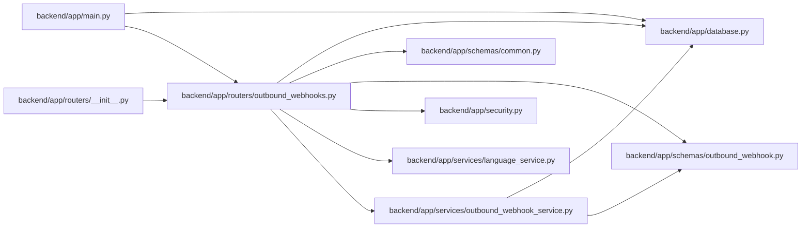

# outbound_webhooks Module

**Path:** `backend/app/routers/outbound_webhooks.py`

## Description

Outbound webhook target and delivery API router.

## Imports

| Source | Symbols |
|--------|---------|
| `app.database` | `get_db` |
| `app.schemas.common` | `MessageResponse` |
| `app.schemas.outbound_webhook` | `OutboundWebhookDeliveryResponse`, `OutboundWebhookRetryResponse`, `OutboundWebhookTargetCreate`, `OutboundWebhookTargetResponse`, `OutboundWebhookTargetUpdate` |
| `app.security` | `require_admin_api_key` |
| `app.services.language_service` | `backend_error_message`, `entity_deleted_message`, `entity_not_found_message`, `resolve_runtime_ui_language` |
| `app.services.outbound_webhook_service` | `OutboundWebhookNotFoundError`, `OutboundWebhookService`, `OutboundWebhookValidationError` |
| `fastapi` | `APIRouter`, `Depends`, `HTTPException`, `Query`, `status` |
| `sqlalchemy.ext.asyncio` | `AsyncSession` |
| `typing` | `Annotated`, `Optional` |

## Local dependency map

<!-- Auto-generated local dependency summary. Do not edit by hand. -->

### Internal neighbors

| Direction | Module |
|---|---|
| Inbound | [app_main](../modules/app_main.md) |
| Inbound | [routers___init__](../modules/routers___init__.md) |
| Outbound | [app_database](../modules/app_database.md) |
| Outbound | [schemas_common](../modules/schemas_common.md) |
| Outbound | [schemas_outbound_webhook](../modules/schemas_outbound_webhook.md) |
| Outbound | [security](../modules/security.md) |
| Outbound | [language_service](../modules/language_service.md) |
| Outbound | [outbound_webhook_service](../modules/outbound_webhook_service.md) |

### External packages

| Language | Used packages | Undeclared packages |
|---|---:|---:|
| python | 2 | 0 |

## Functions

| Function | Signature | Decorators | Description |
|----------|-----------|------------|-------------|
| `get_outbound_webhook_service` | *(async)* `(db: Annotated[AsyncSession, Depends(get_db)]) -> OutboundWebhookService` | — | Dependency for outbound webhook API operations. |
| `_bad_request` | *(async)* `(service: OutboundWebhookService, error: Exception) -> HTTPException` | — | — |
| `list_outbound_webhook_targets` | *(async)* `(service: Annotated[OutboundWebhookService, Depends(get_outbound_webhook_service)])` | `@router.get('/outbound-webhooks/targets', response_model=list[OutboundWebhookTargetResponse])` | List outbound webhook targets. |
| `create_outbound_webhook_target` | *(async)* `(data: OutboundWebhookTargetCreate, service: Annotated[OutboundWebhookService, Depends(get_outbound_webhook_service)])` | `@router.post('/outbound-webhooks/targets', response_model=OutboundWebhookTargetResponse, status_code=status.HTTP_201_CREATED)` | Create an outbound webhook target. |
| `update_outbound_webhook_target` | *(async)* `(target_id: int, data: OutboundWebhookTargetUpdate, service: Annotated[OutboundWebhookService, Depends(get_outbound_webhook_service)])` | `@router.put('/outbound-webhooks/targets/{target_id}', response_model=OutboundWebhookTargetResponse)` | Update an outbound webhook target. |
| `delete_outbound_webhook_target` | *(async)* `(target_id: int, service: Annotated[OutboundWebhookService, Depends(get_outbound_webhook_service)])` | `@router.delete('/outbound-webhooks/targets/{target_id}', response_model=MessageResponse)` | Delete an outbound webhook target while preserving delivery history. |
| `test_outbound_webhook_target` | *(async)* `(target_id: int, service: Annotated[OutboundWebhookService, Depends(get_outbound_webhook_service)])` | `@router.post('/outbound-webhooks/targets/{target_id}/test', response_model=OutboundWebhookRetryResponse)` | Send a test event to one webhook target. |
| `list_outbound_webhook_deliveries` | *(async)* `(service: Annotated[OutboundWebhookService, Depends(get_outbound_webhook_service)], target_id: Optional[int] = Query(None, gt=0), status_filter: Optional[str] = Query(None, alias='status'), channel: str = Query('webhook'), limit: int = Query(50, ge=1, le=200))` | `@router.get('/outbound-webhooks/deliveries', response_model=list[OutboundWebhookDeliveryResponse])` | List recent outbound webhook deliveries. |
| `retry_outbound_webhook_delivery` | *(async)* `(delivery_id: int, service: Annotated[OutboundWebhookService, Depends(get_outbound_webhook_service)])` | `@router.post('/outbound-webhooks/deliveries/{delivery_id}/retry', response_model=OutboundWebhookRetryResponse)` | Retry one outbound webhook or notification delivery. |
