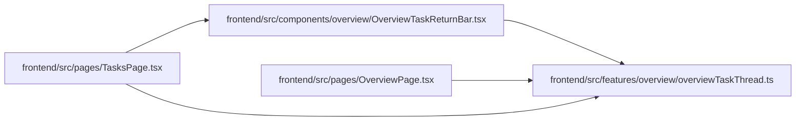

# overviewTaskThread Module

**Path:** `frontend/src/features/overview/overviewTaskThread.ts`

## Description

_Auto-generated from `frontend/src/features/overview/overviewTaskThread.ts`._

## Module Signals

| Signal | Values |
|--------|--------|
| Exports | `OVERVIEW_TASK_ORIGIN`, `OVERVIEW_TASK_ORIGIN_PARAM`, `OVERVIEW_TASK_PARAM`, `OVERVIEW_TASK_RETURN_PARAM`, `OVERVIEW_TASK_THREAD_PARAM`, `OVERVIEW_TASK_THREAD_SOURCES`, `OverviewTaskThreadSource`, `overviewTaskDrawerHref`, `overviewTaskReturnFocusId`, `overviewTaskThreadSource`, `positiveTaskId` |
| Constants | `OVERVIEW_TASK_PARAM`, `OVERVIEW_TASK_ORIGIN_PARAM`, `OVERVIEW_TASK_ORIGIN`, `OVERVIEW_TASK_RETURN_PARAM`, `OVERVIEW_TASK_THREAD_PARAM`, `OVERVIEW_TASK_THREAD_SOURCES` |

## Local dependency map

<!-- Auto-generated local dependency summary. Do not edit by hand. -->

### Internal neighbors

| Direction | Module |
|---|---|
| Inbound | [OverviewTaskReturnBar](../modules/OverviewTaskReturnBar.md) |
| Inbound | [OverviewPage](../modules/OverviewPage.md) |
| Inbound | [TasksPage](../modules/TasksPage.md) |

## Classes

| Class | Kind | Line | Bases / Target | Description |
|-------|------|------|----------------|-------------|
| [OverviewTaskThreadSource](../entities/OverviewTaskThreadSource.md) | Type alias | 8 | — | — |

## Functions

| Function | Signature | Decorators | Description |
|----------|-----------|------------|-------------|
| `positiveTaskId` | `(value: string \| null) -> number \| null` | — | — |
| `overviewTaskThreadSource` | `(value: string \| null) -> OverviewTaskThreadSource \| null` | — | — |
| `overviewTaskReturnFocusId` | `(taskId: number)` | — | — |
| `overviewTaskDrawerHref` | `(taskId: number, source: OverviewTaskThreadSource)` | — | — |
