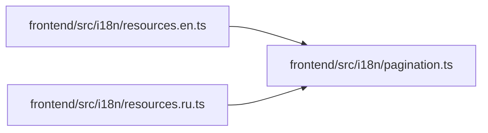

# pagination Module

**Path:** `frontend/src/i18n/pagination.ts`

## Description

_Auto-generated from `frontend/src/i18n/pagination.ts`._

## Module Signals

| Signal | Values |
|--------|--------|
| Exports | `paginationEN`, `paginationRU` |
| Constants | `paginationEN`, `paginationRU` |

## Local dependency map

<!-- Auto-generated local dependency summary. Do not edit by hand. -->

### Internal neighbors

| Direction | Module |
|---|---|
| Inbound | [resources.en](../modules/resources.en.md) |
| Inbound | [resources.ru](../modules/resources.ru.md) |
