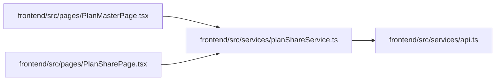

# planShareService Module

**Path:** `frontend/src/services/planShareService.ts`

## Description

_Auto-generated from `frontend/src/services/planShareService.ts`._

## Imports

| Source | Symbols |
|--------|---------|
| `./api` | `api` |

## Module Signals

| Signal | Values |
|--------|--------|
| Exports | `PlanShare`, `PlanShareSnapshot`, `PlanShareTask`, `PlanShareTeamMember`, `planShareService` |
| Constants | `planShareService` |

## Local dependency map

<!-- Auto-generated local dependency summary. Do not edit by hand. -->

### Internal neighbors

| Direction | Module |
|---|---|
| Inbound | [PlanMasterPage](../modules/PlanMasterPage.md) |
| Inbound | [PlanSharePage](../modules/PlanSharePage.md) |
| Outbound | [api](../modules/api.md) |

## Classes

| Class | Kind | Line | Bases / Target | Description |
|-------|------|------|----------------|-------------|
| [PlanShareTask](../entities/PlanShareTask.md) | Class | 3 | — | — |
| [PlanShareTeamMember](../entities/PlanShareTeamMember.md) | Class | 20 | — | — |
| [PlanShareSnapshot](../entities/PlanShareSnapshot.md) | Class | 26 | — | — |
| [PlanShare](../entities/planShareService_PlanShare.md) | Class | 41 | — | — |
