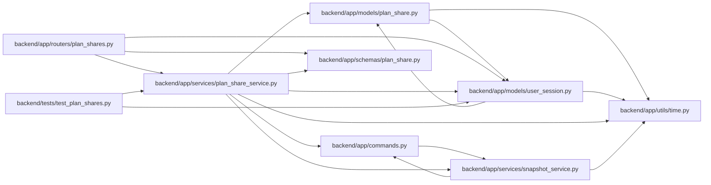

# plan_share_service Module

**Path:** `backend/app/services/plan_share_service.py`

## Description

Creation, ownership, and revocation of immutable plan shares.

## Imports

| Source | Symbols |
|--------|---------|
| `app.commands` | `commit_or_flush` |
| `app.models.plan_share` | `PlanShare` |
| `app.models.user_session` | `UserSession` |
| `app.schemas.plan_share` | `PlanShareResponse` |
| `app.services.snapshot_service` | `SnapshotService` |
| `app.utils.time` | `utc_now` |
| `datetime` | `timedelta` |
| `secrets` | `secrets` |
| `sqlalchemy` | `select`, `update`, `or_` |
| `sqlalchemy.ext.asyncio` | `AsyncSession` |
| `sqlalchemy.orm` | `selectinload` |

## Local dependency map

<!-- Auto-generated local dependency summary. Do not edit by hand. -->

### Internal neighbors

| Direction | Module |
|---|---|
| Inbound | [plan_shares](../modules/plan_shares.md) |
| Inbound | [test_plan_shares](../modules/test_plan_shares.md) |
| Outbound | [commands](../modules/commands.md) |
| Outbound | [models_plan_share](../modules/models_plan_share.md) |
| Outbound | [user_session](../modules/user_session.md) |
| Outbound | [schemas_plan_share](../modules/schemas_plan_share.md) |
| Outbound | [snapshot_service](../modules/snapshot_service.md) |
| Outbound | [time](../modules/time.md) |

### External packages

| Language | Used packages | Undeclared packages |
|---|---:|---:|
| python | 1 | 0 |

## Classes

| Class | Line | Bases | Description |
|-------|------|-------|-------------|
| [PlanShareService](../entities/PlanShareService.md) | 19 | — | Persist plan snapshots without exposing mutable planning records. |
