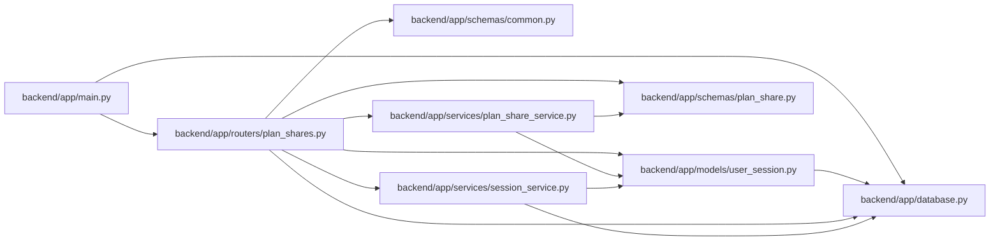

# plan_shares Module

**Path:** `backend/app/routers/plan_shares.py`

## Description

Read-only iteration plan sharing API.

## Imports

| Source | Symbols |
|--------|---------|
| `app.database` | `get_db` |
| `app.models.user_session` | `UserSession` |
| `app.schemas.common` | `MessageResponse` |
| `app.schemas.plan_share` | `PlanShareResponse` |
| `app.services` | `session_service` |
| `app.services.plan_share_service` | `PlanShareService` |
| `fastapi` | `APIRouter`, `Depends`, `HTTPException`, `Response`, `status` |
| `sqlalchemy.ext.asyncio` | `AsyncSession` |
| `typing` | `Annotated` |

## Local dependency map

<!-- Auto-generated local dependency summary. Do not edit by hand. -->

### Internal neighbors

| Direction | Module |
|---|---|
| Inbound | [app_main](../modules/app_main.md) |
| Outbound | [app_database](../modules/app_database.md) |
| Outbound | [user_session](../modules/user_session.md) |
| Outbound | [schemas_common](../modules/schemas_common.md) |
| Outbound | [schemas_plan_share](../modules/schemas_plan_share.md) |
| Outbound | [plan_share_service](../modules/plan_share_service.md) |
| Outbound | [session_service](../modules/session_service.md) |

### External packages

| Language | Used packages | Undeclared packages |
|---|---:|---:|
| python | 2 | 0 |

## Functions

| Function | Signature | Decorators | Description |
|----------|-----------|------------|-------------|
| `get_current_plan_share` | *(async)* `(iteration_id: int, response: Response, current_session: Annotated[UserSession, Depends(session_service.get_current_session)], db: Annotated[AsyncSession, Depends(get_db, scope='function')]) -> PlanShareResponse \| None` | `@router.get('/iterations/{iteration_id}/plan-share', response_model=PlanShareResponse \| None)` | Return the current session's active share for one iteration. |
| `create_plan_share` | *(async)* `(iteration_id: int, response: Response, current_session: Annotated[UserSession, Depends(session_service.get_current_session)], db: Annotated[AsyncSession, Depends(get_db, scope='function')]) -> PlanShareResponse` | `@router.post('/iterations/{iteration_id}/plan-share', response_model=PlanShareResponse, status_code=status.HTTP_201_CREATED)` | Create a new immutable snapshot and revoke this owner's prior link. |
| `get_plan_share` | *(async)* `(public_id: str, response: Response, db: Annotated[AsyncSession, Depends(get_db, scope='function')]) -> PlanShareResponse` | `@router.get('/plan-shares/{public_id}', response_model=PlanShareResponse)` | Resolve a token-scoped immutable snapshot for read-only viewing. |
| `revoke_plan_share` | *(async)* `(share_id: int, response: Response, current_session: Annotated[UserSession, Depends(session_service.get_current_session)], db: Annotated[AsyncSession, Depends(get_db, scope='function')]) -> MessageResponse` | `@router.delete('/plan-shares/{share_id}', response_model=MessageResponse)` | Revoke a share only when the current browser session owns it. |
