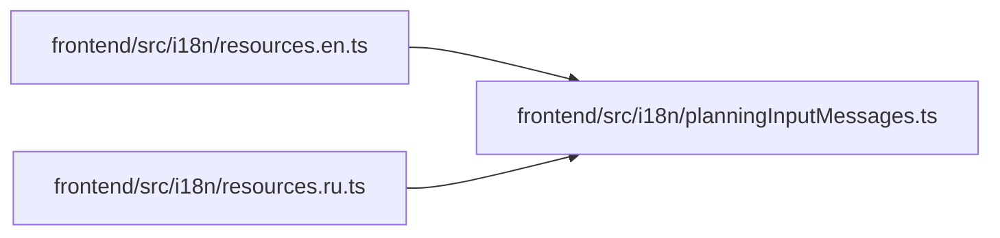

# planningInputMessages Module

**Path:** `frontend/src/i18n/planningInputMessages.ts`

## Description

Planning observation and import messages form a small independent translation namespace. Both locale resources reference it, preserving key parity while keeping the existing route bundle limits unchanged.

## Module Signals

| Signal | Values |
|--------|--------|
| Exports | `planningInputEnglish`, `planningInputRussian` |
| Constants | `planningInputEnglish`, `planningInputRussian` |

## Local dependency map

<!-- Auto-generated local dependency summary. Do not edit by hand. -->

### Internal neighbors

| Direction | Module |
|---|---|
| Inbound | [resources.en](../modules/resources.en.md) |
| Inbound | [resources.ru](../modules/resources.ru.md) |
