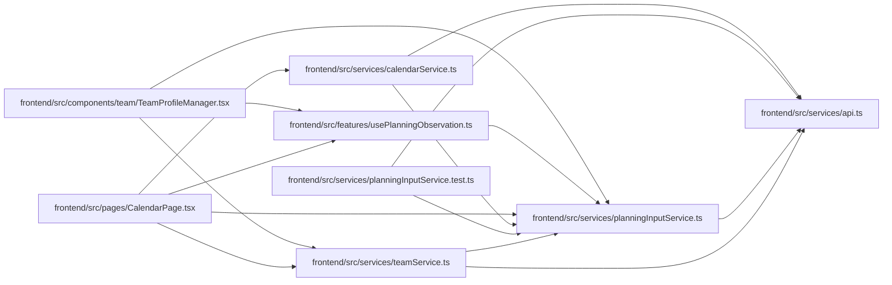

# planningInputService Module

**Path:** `frontend/src/services/planningInputService.ts`

## Description

Reads one resource and its complete revision map before a planning draft opens. The caller retains this observation for the eventual write; this utility does not refresh revisions at save time or silently recover authorization and incomplete-scope failures.

## Imports

| Source | Symbols |
|--------|---------|
| `./api` | `api` |

## Module Signals

| Signal | Values |
|--------|--------|
| Exports | `ObservedPlanningInput`, `ObservedRevisions`, `PlanningInputKind`, `planningInputService`, `revisionHeaders` |
| Constants | `planningInputService` |

## Local dependency map

<!-- Auto-generated local dependency summary. Do not edit by hand. -->

### Internal neighbors

| Direction | Module |
|---|---|
| Inbound | [TeamProfileManager](../modules/TeamProfileManager.md) |
| Inbound | [usePlanningObservation](../modules/usePlanningObservation.md) |
| Inbound | [CalendarPage](../modules/CalendarPage.md) |
| Inbound | [calendarService](../modules/calendarService.md) |
| Inbound | [planningInputService.test](../modules/planningInputService.test.md) |
| Inbound | [teamService](../modules/teamService.md) |
| Outbound | [api](../modules/api.md) |

## Classes

| Class | Kind | Line | Bases / Target | Description |
|-------|------|------|----------------|-------------|
| [ObservedPlanningInput](../entities/ObservedPlanningInput.md) | Class | 4 | — | — |
| [PlanningInputKind](../entities/PlanningInputKind.md) | Type alias | 3 | — | — |
| [ObservedRevisions](../entities/ObservedRevisions.md) | Type alias | 12 | — | — |

## Functions

| Function | Signature | Decorators | Description |
|----------|-----------|------------|-------------|
| `revisionHeaders` | `(revisions: ObservedRevisions)` | — | — |