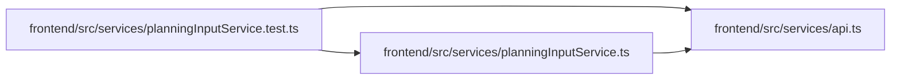

# planningInputService.test Module

**Path:** `frontend/src/services/planningInputService.test.ts`

## Description

_Auto-generated from `frontend/src/services/planningInputService.test.ts`._

## Imports

| Source | Symbols |
|--------|---------|
| `./api` | `api` |
| `./planningInputService` | `planningInputService` |
| `vitest` | `beforeEach`, `expect`, `it`, `vi` |

## Module Signals

| Signal | Values |
|--------|--------|
| Module calls | `mock`, `beforeEach`, `it`, `it`, `it.each([
    { complete: false }, { resource_id: 8 }, { expected_revisions: { 1: 0 } },
    { expected_revisions: { 1: true } }, { expected_revisions: { '-1': 4 } }, { resource: { id: 8 } },
])` |

## Local dependency map

<!-- Auto-generated local dependency summary. Do not edit by hand. -->

### Internal neighbors

| Direction | Module |
|---|---|
| Outbound | [api](../modules/api.md) |
| Outbound | [planningInputService](../modules/planningInputService.md) |

### External packages

| Language | Used packages | Undeclared packages |
|---|---:|---:|
| typescript | 1 | 0 |
