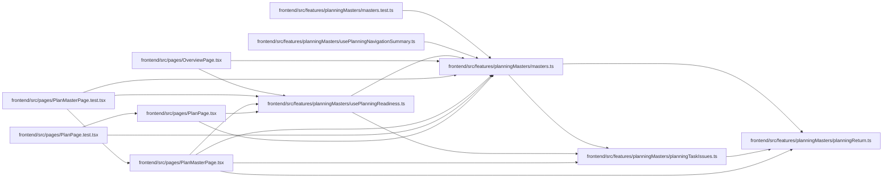

# masters Module

**Path:** `frontend/src/features/planningMasters/masters.ts`

## Description

_Auto-generated from `frontend/src/features/planningMasters/masters.ts`._

## Imports

| Source | Symbols |
|--------|---------|
| `./planningReturn` | `PlanningStepId` |
| `./planningTaskIssues` | `PlanningTaskIssue` |

## Module Signals

| Signal | Values |
|--------|--------|
| Exports | `EMPTY_READINESS`, `MasterStepDef`, `PlanReadiness`, `PlanningRecoveryAction`, `PlanningRecoveryKind`, `STEP_DEFS`, `StepState`, `StepStatus`, `derivePlanningRecovery`, `deriveStatus`, `localizeStatus`, `nextStep`, `readiness` |
| Constants | `STEP_DEFS`, `EMPTY_READINESS` |

## Local dependency map

<!-- Auto-generated local dependency summary. Do not edit by hand. -->

### Internal neighbors

| Direction | Module |
|---|---|
| Inbound | [planningMasters_masters.test](../modules/planningMasters_masters.test.md) |
| Inbound | [usePlanningNavigationSummary](../modules/usePlanningNavigationSummary.md) |
| Inbound | [usePlanningReadiness](../modules/usePlanningReadiness.md) |
| Inbound | [OverviewPage](../modules/OverviewPage.md) |
| Inbound | [PlanMasterPage.test](../modules/PlanMasterPage.test.md) |
| Inbound | [PlanMasterPage](../modules/PlanMasterPage.md) |
| Inbound | [PlanPage.test](../modules/PlanPage.test.md) |
| Inbound | [PlanPage](../modules/PlanPage.md) |
| Outbound | [planningReturn](../modules/planningReturn.md) |
| Outbound | [planningTaskIssues](../modules/planningTaskIssues.md) |

## Classes

| Class | Kind | Line | Bases / Target | Description |
|-------|------|------|----------------|-------------|
| [StepStatus](../entities/StepStatus.md) | Class | 8 | — | — |
| [MasterStepDef](../entities/MasterStepDef.md) | Class | 14 | — | — |
| [PlanReadiness](../entities/PlanReadiness.md) | Class | 93 | — | — |
| [PlanningRecoveryAction](../entities/PlanningRecoveryAction.md) | Class | 122 | — | — |
| [StepState](../entities/StepState.md) | Type alias | 6 | — | — |
| [PlanningRecoveryKind](../entities/PlanningRecoveryKind.md) | Type alias | 112 | — | — |
| [Translate](../entities/Translate.md) | Type alias | 338 | — | — |

## Functions

| Function | Signature | Decorators | Description |
|----------|-----------|------------|-------------|
| `deriveStatus` | `(r: PlanReadiness) -> Record<string, StepStatus>` | — | — |
| `nextStep` | `(status: Record<string, StepStatus>) -> string` | — | — |
| `readiness` | `(status: Record<string, StepStatus>) -> { done: number; total: number; pct: number }` | — | — |
| `localizeStatus` | `(status: Record<string, StepStatus>, r: PlanReadiness, translate: Translate) -> Record<string, StepStatus>` | — | Translate readiness summaries without storing display prose in domain state. |
| `derivePlanningRecovery` | `(selectedStepId: PlanningStepId, r: PlanReadiness) -> PlanningRecoveryAction` | — | Resolve the single workspace action owned by a selected checkpoint. |
