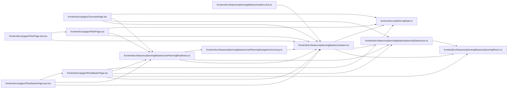

# masters Module

**Path:** `frontend/src/features/planningMasters/masters.ts`

## Description

_Auto-generated from `frontend/src/features/planningMasters/masters.ts`._

## Imports

| Source | Symbols | Type-only | Runtime emission |
|--------|---------|-----------|------------------|
| `../../utils/formatDate` | `formatDate` | — | compiler-dependent |
| `./planningReturn` | `PlanningStepId` | Declaration | erased |
| `./planningTaskIssues` | `PlanningTaskIssue` | Declaration | erased |

## Module Signals

| Signal | Values |
|--------|--------|
| Exports | `EMPTY_READINESS`, `MasterStepDef`, `PlanReadiness`, `PlanningRecoveryAction`, `PlanningRecoveryKind`, `STEP_DEFS`, `StepState`, `StepStatus`, `derivePlanningRecovery`, `deriveStatus`, `localizeStatus`, `nextStep`, `readiness` |
| Constants | `STEP_DEFS`, `EMPTY_READINESS` |

## Local dependency map

<!-- Auto-generated local dependency summary. Do not edit by hand. -->
This graph shows full source coupling. Type dependencies can be erased; compiler-dependent cycle groups are runtime candidates, not confirmed initialization cycles.

```mermaid
flowchart LR
    n0["frontend/src/features/planningMasters/masters.test.ts"]
    n1["frontend/src/features/planningMasters/masters.ts"]
    n2["frontend/src/features/planningMasters/planningReturn.ts"]
    n3["frontend/src/features/planningMasters/planningTaskIssues.ts"]
    n4["frontend/src/features/planningMasters/usePlanningNavigationSummary.ts"]
    n5["frontend/src/features/planningMasters/usePlanningReadiness.ts"]
    n6["frontend/src/pages/OverviewPage.tsx"]
    n7["frontend/src/pages/PlanMasterPage.test.tsx"]
    n8["frontend/src/pages/PlanMasterPage.tsx"]
    n9["frontend/src/pages/PlanPage.test.tsx"]
    n10["frontend/src/pages/PlanPage.tsx"]
    n11["frontend/src/utils/formatDate.ts"]
    n0 --> n1
    n1 --> n2
    n1 --> n3
    n1 --> n11
    n3 --> n2
    n4 --> n1
    n5 --> n1
    n5 --> n3
    n5 --> n4
    n6 --> n1
    n6 --> n3
    n6 --> n5
    n6 --> n11
    n7 --> n1
    n7 --> n5
    n7 --> n8
    n8 --> n1
    n8 --> n2
    n8 --> n3
    n8 --> n5
    n8 --> n11
    n9 --> n1
    n9 --> n10
    n10 --> n1
    n10 --> n5
    n10 --> n11
    click n0 "../modules/planningMasters_masters.test.md"
    click n1 "../modules/planningMasters_masters.md"
    click n2 "../modules/planningReturn.md"
    click n3 "../modules/planningTaskIssues.md"
    click n4 "../modules/usePlanningNavigationSummary.md"
    click n5 "../modules/usePlanningReadiness.md"
    click n6 "../modules/OverviewPage.md"
    click n7 "../modules/PlanMasterPage.test.md"
    click n8 "../modules/PlanMasterPage.md"
    click n9 "../modules/PlanPage.test.md"
    click n10 "../modules/PlanPage.md"
    click n11 "../modules/formatDate.md"
```

### Internal neighbors

| Direction | Module |
|---|---|
| Inbound | [planningMasters_masters.test](../modules/planningMasters_masters.test.md) |
| Inbound | [usePlanningNavigationSummary](../modules/usePlanningNavigationSummary.md) |
| Inbound | [usePlanningReadiness](../modules/usePlanningReadiness.md) |
| Inbound | [OverviewPage](../modules/OverviewPage.md) |
| Inbound | [PlanMasterPage.test](../modules/PlanMasterPage.test.md) |
| Inbound | [PlanMasterPage](../modules/PlanMasterPage.md) |
| Inbound | [PlanPage.test](../modules/PlanPage.test.md) |
| Inbound | [PlanPage](../modules/PlanPage.md) |
| Outbound | [planningReturn](../modules/planningReturn.md) |
| Outbound | [planningTaskIssues](../modules/planningTaskIssues.md) |
| Outbound | [formatDate](../modules/formatDate.md) |

## Classes

| Class | Kind | Line | Bases / Target | Description |
|-------|------|------|----------------|-------------|
| [StepStatus](../entities/StepStatus.md) | Interface | 9 | — | — |
| [MasterStepDef](../entities/MasterStepDef.md) | Interface | 15 | — | — |
| [PlanReadiness](../entities/PlanReadiness.md) | Interface | 94 | — | — |
| [PlanningRecoveryAction](../entities/PlanningRecoveryAction.md) | Interface | 129 | — | — |
| [StepState](../entities/StepState.md) | Type alias | 7 | `'done' \| 'warn' \| 'blocked' \| 'todo'` | — |
| [PlanningRecoveryKind](../entities/PlanningRecoveryKind.md) | Type alias | 119 | <pre><code>&#124; &#39;create&#45;period&#39;&#10;    &#124; &#39;add&#45;team&#39;&#10;    &#124; &#39;repair&#45;capacity&#39;&#10;    &#124; &#39;add&#45;work&#39;&#10;    &#124; &#39;repair&#45;assignee&#39;&#10;    &#124; &#39;repair&#45;effort&#39;&#10;    &#124; &#39;build&#45;schedule&#39;&#10;    &#124; &#39;review&#45;plan&#39;</code></pre> | — |
| [Translate](../entities/Translate.md) | Type alias | 360 | `(key: string, options?: Record<string, unknown>) => string` | — |

## Functions

| Function | Signature | Decorators | Description |
|----------|-----------|------------|-------------|
| `deriveStatus` | `(r: PlanReadiness) -> Record<string, StepStatus>` | — | — |
| `nextStep` | `(status: Record<string, StepStatus>) -> string` | — | — |
| `readiness` | `(status: Record<string, StepStatus>) -> { done: number; total: number; pct: number }` | — | — |
| `localizeStatus` | `(status: Record<string, StepStatus>, r: PlanReadiness, translate: Translate) -> Record<string, StepStatus>` | — | Translate readiness summaries without storing display prose in domain state. |
| `derivePlanningRecovery` | `(selectedStepId: PlanningStepId, r: PlanReadiness) -> PlanningRecoveryAction` | — | Resolve the single workspace action owned by a selected checkpoint. |
