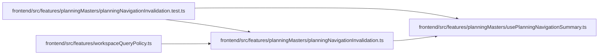

# planningNavigationInvalidation Module

**Path:** `frontend/src/features/planningMasters/planningNavigationInvalidation.ts`

## Description

_Auto-generated from `frontend/src/features/planningMasters/planningNavigationInvalidation.ts`._

## Imports

| Source | Symbols |
|--------|---------|
| `./usePlanningNavigationSummary` | `planningNavigationSummaryKey` |
| `@tanstack/react-query` | `QueryClient`, `QueryCacheNotifyEvent` |

## Module Signals

| Signal | Values |
|--------|--------|
| Exports | `installPlanningNavigationInvalidation` |
| Constants | `READINESS_INPUT_QUERY_ROOTS` |
| Module calls | `READINESS_INPUT_QUERY_ROOTS = Set` |

## Local dependency map

<!-- Auto-generated local dependency summary. Do not edit by hand. -->

### Internal neighbors

| Direction | Module |
|---|---|
| Inbound | [planningNavigationInvalidation.test](../modules/planningNavigationInvalidation.test.md) |
| Inbound | [workspaceQueryPolicy](../modules/workspaceQueryPolicy.md) |
| Outbound | [usePlanningNavigationSummary](../modules/usePlanningNavigationSummary.md) |

### External packages

| Language | Used packages | Undeclared packages |
|---|---:|---:|
| typescript | 1 | 0 |

## Functions

| Function | Signature | Decorators | Description |
|----------|-----------|------------|-------------|
| `installPlanningNavigationInvalidation` | `(queryClient: QueryClient)` | — | — |
