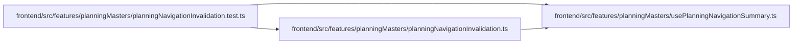

# planningNavigationInvalidation.test Module

**Path:** `frontend/src/features/planningMasters/planningNavigationInvalidation.test.ts`

## Description

_Auto-generated from `frontend/src/features/planningMasters/planningNavigationInvalidation.test.ts`._

## Imports

| Source | Symbols |
|--------|---------|
| `./planningNavigationInvalidation` | `installPlanningNavigationInvalidation` |
| `./usePlanningNavigationSummary` | `planningNavigationSummaryKey` |
| `@tanstack/react-query` | `QueryClient` |
| `vitest` | `describe`, `expect`, `it` |

## Module Signals

| Signal | Values |
|--------|--------|
| Module calls | `describe` |

## Local dependency map

<!-- Auto-generated local dependency summary. Do not edit by hand. -->

### Internal neighbors

| Direction | Module |
|---|---|
| Outbound | [planningNavigationInvalidation](../modules/planningNavigationInvalidation.md) |
| Outbound | [usePlanningNavigationSummary](../modules/usePlanningNavigationSummary.md) |

### External packages

| Language | Used packages | Undeclared packages |
|---|---:|---:|
| typescript | 2 | 0 |
