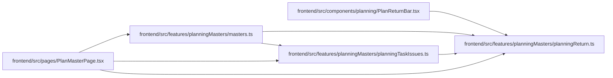

# planningReturn Module

**Path:** `frontend/src/features/planningMasters/planningReturn.ts`

## Description

_Auto-generated from `frontend/src/features/planningMasters/planningReturn.ts`._

## Module Signals

| Signal | Values |
|--------|--------|
| Exports | `PLANNING_RETURN_STEP_PARAM`, `PLANNING_STEP_IDS`, `PlanningStepId`, `isPlanningStepId`, `planMasterStepHref`, `withPlanMasterReturn` |
| Constants | `PLANNING_RETURN_STEP_PARAM`, `PLANNING_STEP_IDS` |

## Local dependency map

<!-- Auto-generated local dependency summary. Do not edit by hand. -->

### Internal neighbors

| Direction | Module |
|---|---|
| Inbound | [PlanReturnBar](../modules/PlanReturnBar.md) |
| Inbound | [planningMasters_masters](../modules/planningMasters_masters.md) |
| Inbound | [planningTaskIssues](../modules/planningTaskIssues.md) |
| Inbound | [PlanMasterPage](../modules/PlanMasterPage.md) |

## Classes

| Class | Kind | Line | Bases / Target | Description |
|-------|------|------|----------------|-------------|
| [PlanningStepId](../entities/PlanningStepId.md) | Type alias | 12 | — | — |

## Functions

| Function | Signature | Decorators | Description |
|----------|-----------|------------|-------------|
| `isPlanningStepId` | `(value: string \| null) -> value is PlanningStepId` | — | — |
| `planMasterStepHref` | `(stepId: PlanningStepId)` | — | — |
| `withPlanMasterReturn` | `(route: string, returnStepId: PlanningStepId, options: Record<string, string> = {})` | — | — |
