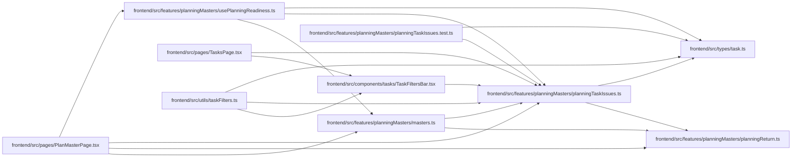

# planningTaskIssues Module

**Path:** `frontend/src/features/planningMasters/planningTaskIssues.ts`

## Description

_Auto-generated from `frontend/src/features/planningMasters/planningTaskIssues.ts`._

## Imports

| Source | Symbols |
|--------|---------|
| `../../types/task` | `Task` |
| `./planningReturn` | `withPlanMasterReturn`, `PlanningStepId` |

## Module Signals

| Signal | Values |
|--------|--------|
| Exports | `PLANNING_ITERATION_PARAM`, `PLANNING_TASK_ISSUES`, `PLANNING_TASK_ISSUE_PARAM`, `PlanningTaskIssue`, `hasPositivePlanningEffort`, `isPlanningLeafTask`, `parsePlanningIterationId`, `parsePlanningTaskIssue`, `planningIssueTasksHref`, `taskMatchesPlanningIssue` |
| Constants | `PLANNING_TASK_ISSUE_PARAM`, `PLANNING_ITERATION_PARAM`, `PLANNING_TASK_ISSUES` |

## Local dependency map

<!-- Auto-generated local dependency summary. Do not edit by hand. -->

### Internal neighbors

| Direction | Module |
|---|---|
| Inbound | [TaskFiltersBar](../modules/TaskFiltersBar.md) |
| Inbound | [planningMasters_masters](../modules/planningMasters_masters.md) |
| Inbound | [planningTaskIssues.test](../modules/planningTaskIssues.test.md) |
| Inbound | [usePlanningReadiness](../modules/usePlanningReadiness.md) |
| Inbound | [PlanMasterPage](../modules/PlanMasterPage.md) |
| Inbound | [TasksPage](../modules/TasksPage.md) |
| Inbound | [taskFilters](../modules/taskFilters.md) |
| Outbound | [planningReturn](../modules/planningReturn.md) |
| Outbound | [types_task](../modules/types_task.md) |

## Classes

| Class | Kind | Line | Bases / Target | Description |
|-------|------|------|----------------|-------------|
| [PlanningTaskIssue](../entities/PlanningTaskIssue.md) | Type alias | 16 | — | — |

## Functions

| Function | Signature | Decorators | Description |
|----------|-----------|------------|-------------|
| `parsePlanningTaskIssue` | `(value: unknown) -> PlanningTaskIssue \| null` | — | — |
| `parsePlanningIterationId` | `(value: unknown) -> number \| null` | — | — |
| `isPlanningLeafTask` | `(task: Task)` | — | — |
| `hasPositivePlanningEffort` | `(value: number \| null) -> value is number` | — | — |
| `taskMatchesPlanningIssue` | `(task: Task, issue: PlanningTaskIssue)` | — | — |
| `planningIssueTasksHref` | `({     issue,     iterationId,     returnStepId, }: {     issue: PlanningTaskIssue;     iterationId: number;     returnStepId: PlanningStepId; })` | — | — |
