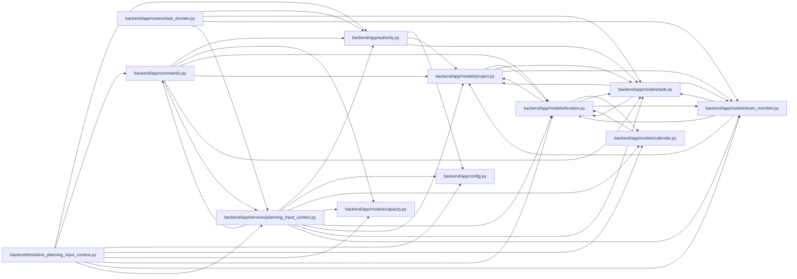

# planning_input_context Module

**Path:** `backend/app/services/planning_input_context.py`

## Description

Resolves the same complete affected iteration set for initial resource observations and shared-input commands. Global calendar/profile edits require operator authority; scoped edits require a complete authorized graph. Reads compare revisions before and after resource data, reject scopes above 500 entries or the transport byte limit, and never reserve versions or emit work. New-member drafts observe the target iteration; valid unused inputs return an explicit empty map.

## Imports

| Source | Symbols |
|--------|---------|
| `app.authority` | `AuthorityError`, `internal_authority`, `require_operator`, `require_project` |
| `app.commands` | `PlanningConflict` |
| `app.config` | `get_settings` |
| `app.models.calendar` | `Calendar`, `Calendar` |
| `app.models.capacity` | `ProfileAvailability` |
| `app.models.iteration` | `Iteration`, `Iteration` |
| `app.models.project` | `Project`, `Project` |
| `app.models.task` | `Task` |
| `app.models.team_member` | `TeamMember`, `TeamMemberProfile`, `Vacation`, `TeamMember`, `TeamMemberProfile`, `Vacation` |
| `json` | `json` |
| `sqlalchemy` | `select` |

## Local dependency map

<!-- Auto-generated local dependency summary. Do not edit by hand. -->

### Internal neighbors

| Direction | Module |
|---|---|
| Inbound | [commands](../modules/commands.md) |
| Inbound | [routers_task_domain](../modules/routers_task_domain.md) |
| Inbound | [test_planning_input_context](../modules/test_planning_input_context.md) |
| Outbound | [authority](../modules/authority.md) |
| Outbound | [commands](../modules/commands.md) |
| Outbound | [config](../modules/config.md) |
| Outbound | [models_calendar](../modules/models_calendar.md) |
| Outbound | [models_capacity](../modules/models_capacity.md) |
| Outbound | [models_iteration](../modules/models_iteration.md) |
| Outbound | [models_project](../modules/models_project.md) |
| Outbound | [models_task](../modules/models_task.md) |
| Outbound | [team_member](../modules/team_member.md) |

### External packages

| Language | Used packages | Undeclared packages |
|---|---:|---:|
| python | 1 | 0 |

## Functions

| Function | Signature | Decorators | Description |
|----------|-----------|------------|-------------|
| `affected_iteration_ids` | *(async)* `(db, kind, values)` | — | Resolve one complete scope for both read observations and atomic writes. |
| `observe_planning_input` | *(async)* `(db, kind, resource_id, *, creating_member = False)` | — | Read data and revisions together; reject drift without advancing any state. |
