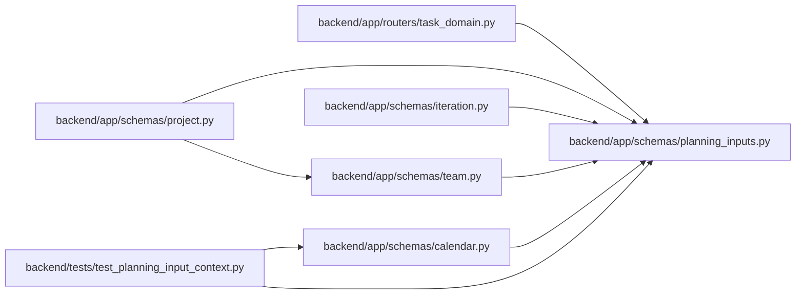

# planning_inputs Module

**Path:** `backend/app/schemas/planning_inputs.py`

## Description

Defines validated working time zones and positive bounded observed revision maps. The initial context DTO binds a resource, resource kind and complete affected iteration observations; empty maps represent valid unused inputs.

## Imports

| Source | Symbols |
|--------|---------|
| `pydantic` | `AfterValidator`, `BaseModel`, `Field`, `PositiveInt` |
| `typing` | `Annotated`, `Any`, `Literal` |
| `zoneinfo` | `ZoneInfo`, `ZoneInfoNotFoundError` |

## Local dependency map

<!-- Auto-generated local dependency summary. Do not edit by hand. -->

### Internal neighbors

| Direction | Module |
|---|---|
| Inbound | [routers_task_domain](../modules/routers_task_domain.md) |
| Inbound | [schemas_calendar](../modules/schemas_calendar.md) |
| Inbound | [schemas_iteration](../modules/schemas_iteration.md) |
| Inbound | [schemas_project](../modules/schemas_project.md) |
| Inbound | [schemas_team](../modules/schemas_team.md) |
| Inbound | [test_planning_input_context](../modules/test_planning_input_context.md) |

### External packages

| Language | Used packages | Undeclared packages |
|---|---:|---:|
| python | 1 | 0 |

## Classes

| Class | Kind | Line | Bases / Target | Description |
|-------|------|------|----------------|-------------|
| [WorkingZone](../entities/WorkingZone.md) | Type alias | 16 | `Annotated[str, AfterValidator(validate_working_zone)]` | — |
| [PlanningInputRevisions](../entities/PlanningInputRevisions.md) | Pydantic model | 19 | `BaseModel` | — |
| [PlanningInputContext](../entities/PlanningInputContext.md) | Pydantic model | 23 | `BaseModel` | — |
| [MemberPlanningIntent](../entities/planning_inputs_MemberPlanningIntent.md) | Pydantic model | 31 | `BaseModel` | — |

## Functions

| Function | Signature | Decorators | Description |
|----------|-----------|------------|-------------|
| `validate_working_zone` | `(value: str) -> str` | — | — |