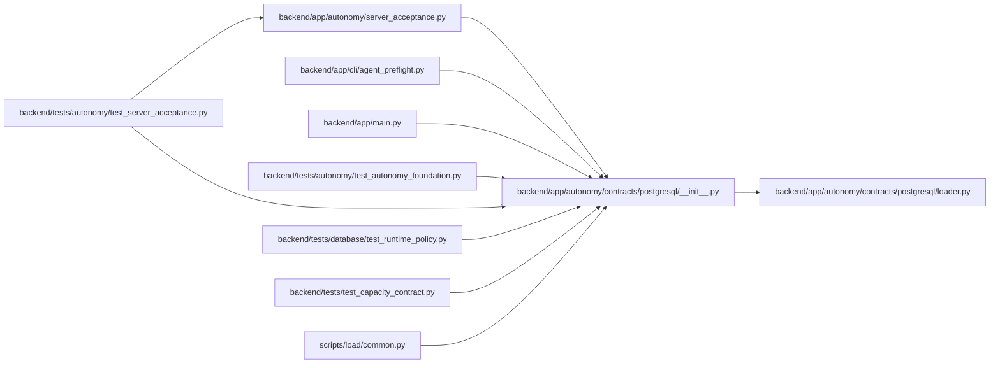

# __init__ Module

**Path:** `backend/app/autonomy/contracts/postgresql/__init__.py`

## Description

Installed PostgreSQL autonomous-program contract bundle.

## Imports

| Source | Symbols |
|--------|---------|
| `app.autonomy.contracts.postgresql.loader` | `ContractBundleError`, `PostgreSQLContractBundle`, `load_postgresql_contract_bundle` |

## Local dependency map

<!-- Auto-generated local dependency summary. Do not edit by hand. -->

### Internal neighbors

| Direction | Module |
|---|---|
| Inbound | [autonomy_server_acceptance](../modules/autonomy_server_acceptance.md) |
| Inbound | [agent_preflight](../modules/agent_preflight.md) |
| Inbound | [app_main](../modules/app_main.md) |
| Inbound | [test_autonomy_foundation](../modules/test_autonomy_foundation.md) |
| Inbound | [test_server_acceptance](../modules/test_server_acceptance.md) |
| Inbound | [test_runtime_policy](../modules/test_runtime_policy.md) |
| Inbound | [test_capacity_contract](../modules/test_capacity_contract.md) |
| Inbound | [load_common](../modules/load_common.md) |
| Outbound | [loader](../modules/loader.md) |
