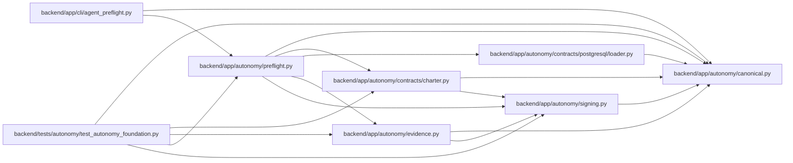

# preflight Module

**Path:** `backend/app/autonomy/preflight.py`

## Description

Deterministic autonomous-start gate evaluation.

## Imports

| Source | Symbols |
|--------|---------|
| `__future__` | `annotations` |
| `app.autonomy.canonical` | `StrictContractModel`, `canonical_json_bytes`, `sha256_hex` |
| `app.autonomy.contracts.charter` | `AutonomyState`, `CharterVerificationReceipt`, `ProgramDecision` |
| `app.autonomy.contracts.postgresql.loader` | `PostgreSQLContractBundle` |
| `app.autonomy.evidence` | `SignedAutonomousEvidence` |
| `app.autonomy.signing` | `DetachedSignatureEnvelope`, `RemoteSigner` |
| `datetime` | `UTC`, `datetime` |
| `pydantic` | `Field`, `model_validator` |
| `typing` | `Literal` |

## Local dependency map

<!-- Auto-generated local dependency summary. Do not edit by hand. -->

### Internal neighbors

| Direction | Module |
|---|---|
| Inbound | [agent_preflight](../modules/agent_preflight.md) |
| Inbound | [test_autonomy_foundation](../modules/test_autonomy_foundation.md) |
| Outbound | [autonomy_canonical](../modules/autonomy_canonical.md) |
| Outbound | [charter](../modules/charter.md) |
| Outbound | [loader](../modules/loader.md) |
| Outbound | [evidence](../modules/evidence.md) |
| Outbound | [signing](../modules/signing.md) |

### External packages

| Language | Used packages | Undeclared packages |
|---|---:|---:|
| python | 1 | 0 |

## Classes

| Class | Line | Bases | Description |
|-------|------|-------|-------------|
| [VerifiedPreflightArtifact](../entities/VerifiedPreflightArtifact.md) | 65 | `StrictContractModel` | — |
| [PreflightPredicateResult](../entities/PreflightPredicateResult.md) | 85 | `StrictContractModel` | — |
| [AgentPreflightReport](../entities/AgentPreflightReport.md) | 93 | `StrictContractModel` | — |
| [SignedAgentPreflightReport](../entities/SignedAgentPreflightReport.md) | 118 | `StrictContractModel` | — |

## Functions

| Function | Signature | Decorators | Description |
|----------|-----------|------------|-------------|
| `evaluate_agent_preflight` | `(*, release_fingerprint: str, bundle: PostgreSQLContractBundle, charter_receipt: CharterVerificationReceipt \| None, artifacts: tuple[VerifiedPreflightArtifact, ...] = (), advertised_features: set[str] \| frozenset[str] = frozenset(), evaluated_at: datetime \| None = None) -> AgentPreflightReport` | — | Evaluate every start row; missing facts are explicit blockers, never skips. |
| `sign_agent_preflight` | `(report: AgentPreflightReport, *, signer: RemoteSigner, key_ref: str, subject: str = 'pg-program-controller') -> SignedAgentPreflightReport` | — | — |
