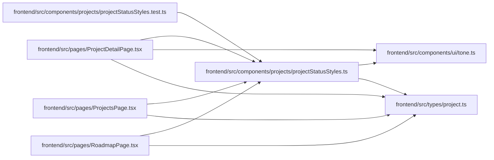

# projectStatusStyles Module

**Path:** `frontend/src/components/projects/projectStatusStyles.ts`

## Description

_Auto-generated from `frontend/src/components/projects/projectStatusStyles.ts`._

## Imports

| Source | Symbols |
|--------|---------|
| `../../types/project` | `ProjectMilestoneStatus`, `ProjectStatus` |
| `../ui/tone` | `toneBorderClassName`, `wcPillClass`, `PillTone` |

## Module Signals

| Signal | Values |
|--------|--------|
| Exports | `ProjectRecordStatus`, `projectStatusBadgeClassName`, `projectStatusPillClassName` |
| Constants | `projectRecordStatusTone` |

## Local dependency map

<!-- Auto-generated local dependency summary. Do not edit by hand. -->

### Internal neighbors

| Direction | Module |
|---|---|
| Inbound | [projectStatusStyles.test](../modules/projectStatusStyles.test.md) |
| Inbound | [ProjectDetailPage](../modules/ProjectDetailPage.md) |
| Inbound | [ProjectsPage](../modules/ProjectsPage.md) |
| Inbound | [RoadmapPage](../modules/RoadmapPage.md) |
| Outbound | [tone](../modules/tone.md) |
| Outbound | [types_project](../modules/types_project.md) |

## Classes

| Class | Kind | Line | Bases / Target | Description |
|-------|------|------|----------------|-------------|
| [ProjectRecordStatus](../entities/ProjectRecordStatus.md) | Type alias | 8 | — | — |

## Functions

| Function | Signature | Decorators | Description |
|----------|-----------|------------|-------------|
| `projectStatusBadgeClassName` | `(status: ProjectRecordStatus)` | — | — |
| `projectStatusPillClassName` | `(status: ProjectRecordStatus)` | — | — |
