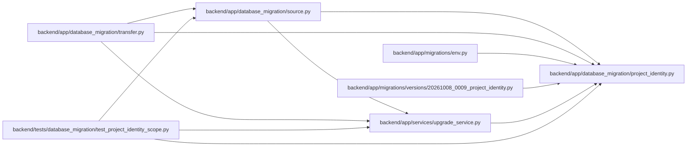

# project_identity Module

**Path:** `backend/app/database_migration/project_identity.py`

## Description

Read-only project identity qualification and retained allocation floors. The allocation floor includes live references, retained time and correction scope, durable delivery and usage observations, and bounded historical audit, outbox and recovery payloads. Contradictory creation/deletion provenance or incomplete historical scans stop qualification without reassociating or changing stored records. Diagnostic output includes bounded identities and reasons, never private notes.

## Imports

| Source | Symbols |
|--------|---------|
| `datetime` | `UTC`, `datetime` |
| `json` | `json` |
| `sqlalchemy` | `MetaData`, `String`, `Table`, `cast`, `create_engine`, `func`, `inspect`, `select`, `text` |
| `sqlalchemy.pool` | `NullPool` |
| `sqlite3` | `sqlite3` |
| `urllib.parse` | `quote` |

## Local dependency map

<!-- Auto-generated local dependency summary. Do not edit by hand. -->

### Internal neighbors

| Direction | Module |
|---|---|
| Inbound | [source](../modules/source.md) |
| Inbound | [transfer](../modules/transfer.md) |
| Inbound | [migrations_env](../modules/migrations_env.md) |
| Inbound | [20261008_0009_project_identity](../modules/20261008_0009_project_identity.md) |
| Inbound | [upgrade_service](../modules/upgrade_service.md) |
| Inbound | [test_project_identity_scope](../modules/test_project_identity_scope.md) |

### External packages

| Language | Used packages | Undeclared packages |
|---|---:|---:|
| python | 1 | 0 |

## Classes

| Class | Line | Bases | Description |
|-------|------|-------|-------------|
| [ProjectIdentityError](../entities/ProjectIdentityError.md) | 12 | `RuntimeError` | Refuse an ambiguous identity without changing historical associations. |

## Functions

| Function | Signature | Decorators | Description |
|----------|-----------|------------|-------------|
| `_utc` | `(value)` | — | — |
| `_project_ids` | `(value)` | — | — |
| `inspect_project_identity` | `(connection, *, max_history_rows = 10000, max_history_bytes = 256 * 1024 * 1024)` | — | Bound diagnostics and historical JSON scans; never inspect private text fields. |
| `project_allocation_floor` | `(connection)` | — | Require identity qualification before returning a safe allocation floor. |
| `sqlite_project_allocation_floor` | `(path)` | — | Qualify one immutable SQLite source through a separately owned read-only handle. |