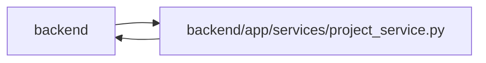

# project_service Module

**Path:** `backend/app/services/project_service.py`

## Description

Project service with CRUD and summary logic.

## Imports

| Source | Symbols |
|--------|---------|
| `app.models.iteration` | `Iteration` |
| `app.models.project` | `Initiative`, `Project`, `ProjectMilestone`, `ProjectMilestoneStatus`, `ProjectStatus`, `ProjectUpdateEntry` |
| `app.models.task` | `Task`, `TaskDependency`, `TaskStatus` |
| `app.models.team_member` | `TeamMember`, `TeamMemberProfile` |
| `app.query_limits` | `CollectionLimitExceededError`, `MAX_BOUNDED_LIST_ITEMS`, `MAX_PROJECT_LIST_ITEMS`, `MAX_PROJECT_TREE_TASKS` |
| `app.schemas.project` | `InitiativeCreate`, `InitiativeUpdate`, `ProjectCreate`, `ProjectMilestoneCreateRequest`, `ProjectMilestoneSummary`, `ProjectMilestoneTaskGroup`, `ProjectMilestoneUpdate`, `ProjectPortfolioSummary`, `ProjectSummary`, `STALE_PROJECT_UPDATE_DAYS`, `ProjectTargetDateRisk`, `ProjectUpdate`, `ProjectUpdateEntryCreate`, `ProjectUpdateEntryResponse`, `ProjectUpdateFreshness` |
| `app.schemas.team` | `TeamMemberOptionResponse`, `TeamMemberProfileCompact` |
| `app.services.outbound_webhook_service` | `emit_outbound_webhook_event` |
| `app.services.request_source_service` | `RequestSourceService` |
| `app.sql_semantics` | `portable_case_insensitive_equal` |
| `app.utils.time` | `as_utc`, `utc_now` |
| `datetime` | `date`, `datetime` |
| `sqlalchemy` | `Select`, `case`, `exists`, `func`, `select`, `update` |
| `sqlalchemy.ext.asyncio` | `AsyncSession` |
| `sqlalchemy.orm` | `aliased`, `selectinload` |
| `typing` | `Optional`, `Sequence` |

## Local dependency map

<!-- Auto-generated local dependency summary. Do not edit by hand. -->

> Module-level dependencies exceed the generated-diagram limits, so the diagram and table below group them by top-level package. Counts report the number of module neighbors in each package.

### Internal neighbors

| Direction | Module |
|---|---|
| Inbound | `backend` (5) |
| Outbound | `backend` (11) |

### External packages

| Language | Used packages | Undeclared packages |
|---|---:|---:|
| python | 1 | 0 |

> All 16 module neighbor(s) are summarized by package because the module-level view exceeds the 12-node limit.

## Classes

| Class | Line | Bases | Description |
|-------|------|-------|-------------|
| [ProjectService](../entities/ProjectService.md) | 51 | — | Service for project CRUD, linked task retrieval, and summary metrics. |
