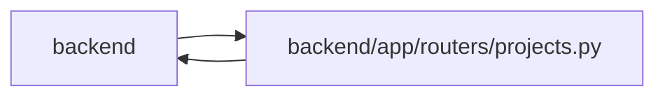

# projects Module

**Path:** `backend/app/routers/projects.py`

## Description

Project API router.

## Imports

| Source | Symbols |
|--------|---------|
| `app.database` | `get_db` |
| `app.models.user_session` | `UserSession` |
| `app.query_limits` | `MAX_BOUNDED_LIST_ITEMS` |
| `app.schemas.common` | `MessageResponse` |
| `app.schemas.iteration` | `IterationResponse` |
| `app.schemas.project` | `InitiativeCreate`, `InitiativeResponse`, `InitiativeUpdate`, `ProjectCreate`, `ProjectMilestoneCreateRequest`, `ProjectMilestoneDeleteResponse`, `ProjectMilestoneResponse`, `ProjectMilestoneUpdate`, `ProjectPortfolioSummary`, `ProjectPortfolioPage`, `ProjectResponse`, `ProjectPage`, `ProjectSummary`, `ProjectUpdate`, `ProjectUpdateEntryCreate`, `ProjectUpdateEntryResponse`, `RoadmapMilestonePage` |
| `app.schemas.release` | `ReleaseCreateRequest`, `ReleaseResponse`, `ReleaseUpdateRequest` |
| `app.schemas.task` | `TaskResponse` |
| `app.services` | `session_service` |
| `app.services.iteration_service` | `IterationService` |
| `app.services.language_service` | `backend_error_message`, `entity_deleted_message`, `entity_not_found_message`, `resolve_runtime_ui_language`, `scoped_entity_not_found_message` |
| `app.services.project_service` | `ProjectService` |
| `app.services.release_service` | `ReleaseService` |
| `app.services.task_service` | `TaskService` |
| `fastapi` | `APIRouter`, `Depends`, `HTTPException`, `Query`, `status` |
| `sqlalchemy.ext.asyncio` | `AsyncSession` |
| `typing` | `Annotated`, `Any` |

## Local dependency map

<!-- Auto-generated local dependency summary. Do not edit by hand. -->

> Module-level dependencies exceed the generated-diagram limits, so the diagram and table below group them by top-level package. Counts report the number of module neighbors in each package.

### Internal neighbors

| Direction | Module |
|---|---|
| Inbound | `backend` (2) |
| Outbound | `backend` (14) |

### External packages

| Language | Used packages | Undeclared packages |
|---|---:|---:|
| python | 2 | 0 |

> All 16 module neighbor(s) are summarized by package because the module-level view exceeds the 12-node limit.

## Functions

| Function | Signature | Decorators | Description |
|----------|-----------|------------|-------------|
| `get_project_service` | *(async)* `(db: Annotated[AsyncSession, Depends(get_db, scope='function')]) -> ProjectService` | — | Dependency for project service. |
| `get_release_service` | *(async)* `(db: Annotated[AsyncSession, Depends(get_db, scope='function')]) -> ReleaseService` | — | Dependency for release service. |
| `_localized_detail` | *(async)* `(service: Any, message: str) -> str` | — | — |
| `_not_found_detail` | *(async)* `(service: Any, entity: str, entity_id: int) -> str` | — | — |
| `_scoped_not_found_detail` | *(async)* `(service: Any, entity: str, entity_id: int, scope: str, scope_id: int) -> str` | — | — |
| `get_portfolio_summary_page` | *(async)* `(service: Annotated[ProjectService, Depends(get_project_service)], limit: int = Query(default=100, ge=1, le=100), after_id: int = Query(default=0, ge=0), upper_id: int \| None = Query(default=None, ge=0))` | `@router.get('/projects/portfolio-summaries/page', response_model=ProjectPortfolioPage)` | — |
| `get_project_page` | *(async)* `(service: Annotated[ProjectService, Depends(get_project_service)], limit: int = Query(default=100, ge=1, le=100), after_id: int = Query(default=0, ge=0), upper_id: int \| None = Query(default=None, ge=0))` | `@router.get('/projects/page', response_model=ProjectPage)` | — |
| `list_projects` | *(async)* `(service: Annotated[ProjectService, Depends(get_project_service)])` | `@router.get('/projects', response_model=list[ProjectResponse])` | List all projects. |
| `list_project_portfolio_summaries` | *(async)* `(service: Annotated[ProjectService, Depends(get_project_service)])` | `@router.get('/projects/portfolio-summaries', response_model=list[ProjectPortfolioSummary])` | List compact project signals without one request per portfolio row. |
| `list_roadmap_milestones` | *(async)* `(service: Annotated[ProjectService, Depends(get_project_service)], after_id: Annotated[int \| None, Query(ge=0)] = None, limit: Annotated[int, Query(ge=1, le=MAX_BOUNDED_LIST_ITEMS)] = MAX_BOUNDED_LIST_ITEMS)` | `@router.get('/roadmap/milestones', response_model=RoadmapMilestonePage)` | List a bounded cursor page of portfolio milestone markers. |
| `list_initiatives` | *(async)* `(service: Annotated[ProjectService, Depends(get_project_service)])` | `@router.get('/initiatives', response_model=list[InitiativeResponse])` | List all initiatives. |
| `create_initiative` | *(async)* `(data: InitiativeCreate, service: Annotated[ProjectService, Depends(get_project_service)])` | `@router.post('/initiatives', response_model=InitiativeResponse, status_code=status.HTTP_201_CREATED)` | Create an initiative. |
| `get_initiative` | *(async)* `(initiative_id: int, service: Annotated[ProjectService, Depends(get_project_service)])` | `@router.get('/initiatives/{initiative_id}', response_model=InitiativeResponse)` | Get an initiative by ID. |
| `update_initiative` | *(async)* `(initiative_id: int, data: InitiativeUpdate, service: Annotated[ProjectService, Depends(get_project_service)])` | `@router.put('/initiatives/{initiative_id}', response_model=InitiativeResponse)` | Update an initiative. |
| `delete_initiative` | *(async)* `(initiative_id: int, service: Annotated[ProjectService, Depends(get_project_service)])` | `@router.delete('/initiatives/{initiative_id}', response_model=MessageResponse)` | Delete an initiative and leave assigned projects intact. |
| `create_project` | *(async)* `(data: ProjectCreate, service: Annotated[ProjectService, Depends(get_project_service)])` | `@router.post('/projects', response_model=ProjectResponse, status_code=status.HTTP_201_CREATED)` | Create a project. |
| `get_project` | *(async)* `(project_id: int, service: Annotated[ProjectService, Depends(get_project_service)])` | `@router.get('/projects/{project_id}', response_model=ProjectResponse)` | Get a project by ID. |
| `update_project` | *(async)* `(project_id: int, data: ProjectUpdate, service: Annotated[ProjectService, Depends(get_project_service)])` | `@router.put('/projects/{project_id}', response_model=ProjectResponse)` | Update a project. |
| `create_project_update` | *(async)* `(project_id: int, data: ProjectUpdateEntryCreate, service: Annotated[ProjectService, Depends(get_project_service)], current_session: Annotated[UserSession, Depends(session_service.get_current_session)])` | `@router.post('/projects/{project_id}/updates', response_model=ProjectUpdateEntryResponse, status_code=status.HTTP_201_CREATED)` | Create an append-only structured update for a project. |
| `list_project_updates` | *(async)* `(project_id: int, service: Annotated[ProjectService, Depends(get_project_service)])` | `@router.get('/projects/{project_id}/updates', response_model=list[ProjectUpdateEntryResponse])` | List append-only structured updates for a project. |
| `list_project_milestones` | *(async)* `(project_id: int, service: Annotated[ProjectService, Depends(get_project_service)])` | `@router.get('/projects/{project_id}/milestones', response_model=list[ProjectMilestoneResponse])` | List milestones for a project in roadmap order. |
| `create_project_milestone` | *(async)* `(project_id: int, data: ProjectMilestoneCreateRequest, service: Annotated[ProjectService, Depends(get_project_service)])` | `@router.post('/projects/{project_id}/milestones', response_model=ProjectMilestoneResponse, status_code=status.HTTP_201_CREATED)` | Create a project-scoped milestone. |
| `update_project_milestone` | *(async)* `(project_id: int, milestone_id: int, data: ProjectMilestoneUpdate, service: Annotated[ProjectService, Depends(get_project_service)])` | `@router.patch('/projects/{project_id}/milestones/{milestone_id}', response_model=ProjectMilestoneResponse)` | Update a milestone that belongs to the project path. |
| `delete_project_milestone` | *(async)* `(project_id: int, milestone_id: int, service: Annotated[ProjectService, Depends(get_project_service)])` | `@router.delete('/projects/{project_id}/milestones/{milestone_id}', response_model=ProjectMilestoneDeleteResponse)` | Delete a project milestone while keeping linked tasks. |
| `list_project_iterations` | *(async)* `(project_id: int, service: Annotated[ProjectService, Depends(get_project_service)])` | `@router.get('/projects/{project_id}/iterations', response_model=list[IterationResponse])` | List iterations explicitly scoped to a project. |
| `list_project_releases` | *(async)* `(project_id: int, service: Annotated[ReleaseService, Depends(get_release_service)])` | `@router.get('/projects/{project_id}/releases', response_model=list[ReleaseResponse])` | List releases for a project. |
| `create_project_release` | *(async)* `(project_id: int, data: ReleaseCreateRequest, service: Annotated[ReleaseService, Depends(get_release_service)])` | `@router.post('/projects/{project_id}/releases', response_model=ReleaseResponse, status_code=status.HTTP_201_CREATED)` | Create a release for a project. |
| `get_release` | *(async)* `(release_id: int, service: Annotated[ReleaseService, Depends(get_release_service)])` | `@router.get('/releases/{release_id}', response_model=ReleaseResponse)` | Get a release by ID. |
| `update_release` | *(async)* `(release_id: int, data: ReleaseUpdateRequest, service: Annotated[ReleaseService, Depends(get_release_service)])` | `@router.put('/releases/{release_id}', response_model=ReleaseResponse)` | Update release metadata and task links. |
| `delete_project` | *(async)* `(project_id: int, service: Annotated[ProjectService, Depends(get_project_service)], detach_tasks: bool = Query(False))` | `@router.delete('/projects/{project_id}', response_model=MessageResponse)` | Delete a project, optionally detaching linked tasks first. |
| `get_project_tasks` | *(async)* `(project_id: int, service: Annotated[ProjectService, Depends(get_project_service)])` | `@router.get('/projects/{project_id}/tasks', response_model=list[TaskResponse])` | Get linked project task tree roots. |
| `get_project_summary` | *(async)* `(project_id: int, service: Annotated[ProjectService, Depends(get_project_service)])` | `@router.get('/projects/{project_id}/summary', response_model=ProjectSummary)` | Get project summary metrics. |
