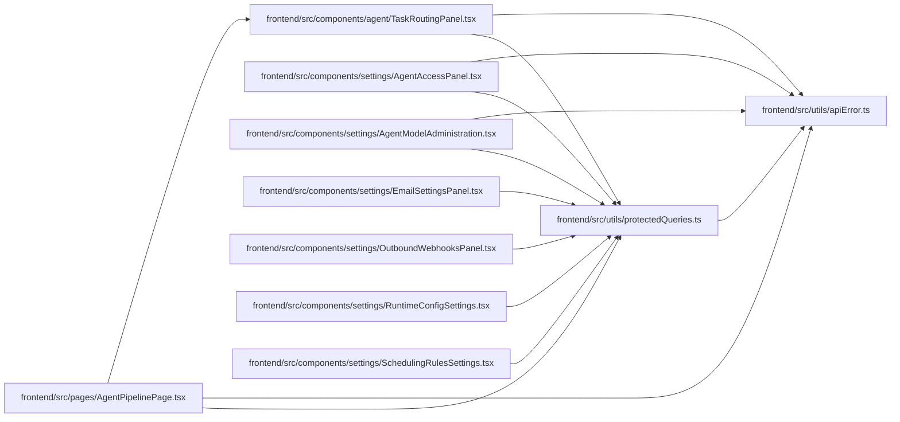

# protectedQueries Module

**Path:** `frontend/src/utils/protectedQueries.ts`

## Description

_Auto-generated from `frontend/src/utils/protectedQueries.ts`._

## Imports

| Source | Symbols |
|--------|---------|
| `./apiError` | `getApiErrorStatus` |

## Module Signals

| Signal | Values |
|--------|--------|
| Exports | `protectedQueryRetry` |

## Local dependency map

<!-- Auto-generated local dependency summary. Do not edit by hand. -->

### Internal neighbors

| Direction | Module |
|---|---|
| Inbound | [TaskRoutingPanel](../modules/TaskRoutingPanel.md) |
| Inbound | [AgentAccessPanel](../modules/AgentAccessPanel.md) |
| Inbound | [AgentModelAdministration](../modules/AgentModelAdministration.md) |
| Inbound | [EmailSettingsPanel](../modules/EmailSettingsPanel.md) |
| Inbound | [OutboundWebhooksPanel](../modules/OutboundWebhooksPanel.md) |
| Inbound | [RuntimeConfigSettings](../modules/RuntimeConfigSettings.md) |
| Inbound | [SchedulingRulesSettings](../modules/SchedulingRulesSettings.md) |
| Inbound | [AgentPipelinePage](../modules/AgentPipelinePage.md) |
| Outbound | [apiError](../modules/apiError.md) |

## Functions

| Function | Signature | Decorators | Description |
|----------|-----------|------------|-------------|
| `protectedQueryRetry` | `(failureCount: number, error: unknown)` | — | — |
