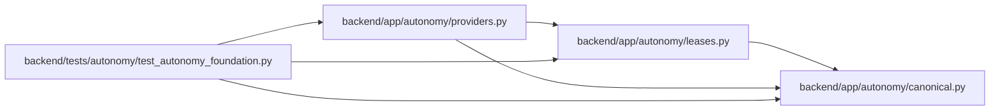

# providers Module

**Path:** `backend/app/autonomy/providers.py`

## Description

Provider mutation/source-collection boundaries and correlation rules.

## Imports

| Source | Symbols |
|--------|---------|
| `__future__` | `annotations` |
| `app.autonomy.canonical` | `StrictContractModel`, `canonical_json_bytes`, `ensure_secret_free`, `sha256_hex` |
| `app.autonomy.leases` | `SignedActionLease` |
| `datetime` | `datetime`, `timedelta` |
| `pydantic` | `Field`, `field_validator`, `model_validator` |
| `typing` | `Literal`, `Protocol`, `runtime_checkable` |

## Local dependency map

<!-- Auto-generated local dependency summary. Do not edit by hand. -->

### Internal neighbors

| Direction | Module |
|---|---|
| Inbound | [test_autonomy_foundation](../modules/test_autonomy_foundation.md) |
| Outbound | [autonomy_canonical](../modules/autonomy_canonical.md) |
| Outbound | [leases](../modules/leases.md) |

### External packages

| Language | Used packages | Undeclared packages |
|---|---:|---:|
| python | 1 | 0 |

## Classes

| Class | Line | Bases | Description |
|-------|------|-------|-------------|
| [ProviderActionRequest](../entities/ProviderActionRequest.md) | 24 | `StrictContractModel` | Exact mutation request; adapter selection remains charter-owned. |
| [ProviderMutationReceipt](../entities/ProviderMutationReceipt.md) | 70 | `StrictContractModel` | Adapter response only; it cannot establish acceptance by itself. |
| [ProviderAuditObservation](../entities/ProviderAuditObservation.md) | 96 | `StrictContractModel` | Separately credentialed read-only provider/audit observation. |
| [CorrelatedProviderAction](../entities/CorrelatedProviderAction.md) | 123 | `StrictContractModel` | — |
| [ProviderMutationAdapter](../entities/ProviderMutationAdapter.md) | 139 | `Protocol` | — |
| [ProviderSourceCollector](../entities/ProviderSourceCollector.md) | 144 | `Protocol` | — |
| [CollectorBinding](../entities/CollectorBinding.md) | 192 | `StrictContractModel` | — |
| [SourceCollectorRegistry](../entities/SourceCollectorRegistry.md) | 201 | `StrictContractModel` | — |
| [MetricSample](../entities/MetricSample.md) | 222 | `StrictContractModel` | — |
| [CompleteMetricWindow](../entities/CompleteMetricWindow.md) | 235 | `StrictContractModel` | — |
| [ReplicaMembershipObservation](../entities/ReplicaMembershipObservation.md) | 268 | `StrictContractModel` | — |

## Functions

| Function | Signature | Decorators | Description |
|----------|-----------|------------|-------------|
| `correlate_provider_action` | `(*, request: ProviderActionRequest, mutation: ProviderMutationReceipt, audit: ProviderAuditObservation, maximum_clock_delta: timedelta = timedelta(minutes=5)) -> CorrelatedProviderAction` | — | Require independent request/audit/resource/generation agreement. |
