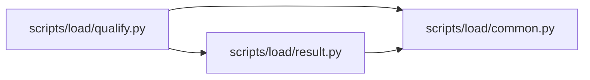

# qualify Module

**Path:** `scripts/load/qualify.py`

## Description

Freeze, assemble, sign, and verify PostgreSQL capacity qualification.

## Imports

| Source | Symbols |
|--------|---------|
| `__future__` | `annotations` |
| `argparse` | `argparse` |
| `base64` | `base64` |
| `cryptography.exceptions` | `InvalidSignature` |
| `cryptography.hazmat.primitives` | `serialization` |
| `cryptography.hazmat.primitives.asymmetric.ed25519` | `Ed25519PrivateKey`, `Ed25519PublicKey` |
| `datetime` | `timedelta`, `datetime` |
| `jsonschema` | `Draft202012Validator`, `FormatChecker` |
| `os` | `os` |
| `pathlib` | `Path` |
| `re` | `re` |
| `scripts.load.common` | `DATA_LIFECYCLE_POLICY_MEMBER`, `QUALIFICATION_SCHEMA_MEMBER`, `QualificationInputError`, `atomic_write_json`, `canonical_json_bytes`, `capacity_contract`, `contract_member_json`, `contract_member_sha256`, `contract_sha256`, `read_json_object`, `sha256_bytes`, `sha256_file`, `utc_now_text`, `verify_document` |
| `scripts.load.result` | `validate_result` |
| `stat` | `stat` |
| `sys` | `sys` |
| `typing` | `Any`, `Mapping` |
| `uuid` | `uuid4` |

## Local dependency map

<!-- Auto-generated local dependency summary. Do not edit by hand. -->

### Internal neighbors

| Direction | Module |
|---|---|
| Outbound | [load_common](../modules/load_common.md) |
| Outbound | [result](../modules/result.md) |

### External packages

| Language | Used packages | Undeclared packages |
|---|---:|---:|
| python | 2 | 2 |

## Functions

| Function | Signature | Decorators | Description |
|----------|-----------|------------|-------------|
| `_reject_local_signing_in_zero_human_mode` | `() -> None` | — | — |
| `_schema_errors` | `(document: Mapping[str, Any]) -> list[str]` | — | — |
| `_fingerprint` | `(payload: Mapping[str, Any]) -> str` | — | — |
| `_require_new_output` | `(path: Path) -> None` | — | — |
| `_validate_frozen_release` | `(document: Mapping[str, Any]) -> None` | — | — |
| `_freeze` | `(args: argparse.Namespace) -> int` | — | — |
| `_require_ci_evidence` | `(document: Mapping[str, Any], commit: str) -> None` | — | — |
| `_bundle` | `(args: argparse.Namespace) -> int` | — | — |
| `_parse_time` | `(value: str)` | — | — |
| `_is_sha256` | `(value: object) -> bool` | — | — |
| `_validate_run_bundle` | `(document: Mapping[str, Any], release: Mapping[str, Any]) -> None` | — | — |
| `_private_key` | `(path: Path) -> Ed25519PrivateKey` | — | — |
| `_finalize` | `(args: argparse.Namespace) -> int` | — | — |
| `_verify_report` | `(document: Mapping[str, Any]) -> None` | — | — |
| `_verify` | `(args: argparse.Namespace) -> int` | — | — |
| `_parser` | `() -> argparse.ArgumentParser` | — | — |
| `main` | `() -> int` | — | — |
