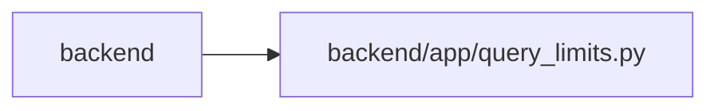

# query_limits Module

**Path:** `backend/app/query_limits.py`

## Description

Explicit response cardinality bounds for synchronous API surfaces.

## Imports

| Source | Symbols |
|--------|---------|
| `__future__` | `annotations` |

## Local dependency map

<!-- Auto-generated local dependency summary. Do not edit by hand. -->

> Module-level dependencies exceed the generated-diagram limits, so the diagram and table below group them by top-level package. Counts report the number of module neighbors in each package.

### Internal neighbors

| Direction | Module |
|---|---|
| Inbound | `backend` (17) |

> All 17 module neighbor(s) are summarized by package because the module-level view exceeds the 12-node limit.

## Classes

| Class | Line | Bases | Description |
|-------|------|-------|-------------|
| [CollectionLimitExceededError](../entities/CollectionLimitExceededError.md) | 14 | `RuntimeError` | A synchronous endpoint would exceed its documented response bound. |
