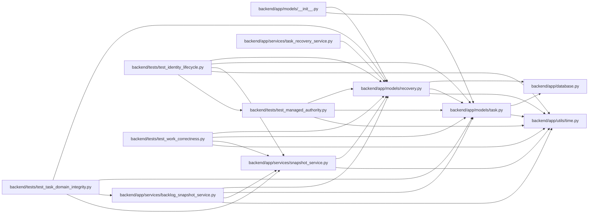

# recovery Module

**Path:** `backend/app/models/recovery.py`

## Description

Transactional application recovery points and explicit schedule commitments.

Application snapshots and their legacy provenance inventory live in the database. Schedule baseline history records explicit commitments separately from mutable forecasts and actual UTC events. These records support scoped application recovery and are not a substitute for a complete database backup.

The task deletion hook writes the highest observed task version to an independent table in the same ORM transaction, including cascaded children and removals during recovery. Rollback removes an uncommitted fence. A surviving fence protects later reuse of the task ID; the upgrade does not invent records for historical deletions.

## Imports

| Source | Symbols |
|--------|---------|
| `app.database` | `Base` |
| `app.models.task` | `Task`, `Task` |
| `app.utils.time` | `UTCDateTime`, `utc_now` |
| `datetime` | `date`, `datetime` |
| `sqlalchemy` | `ForeignKey`, `Integer`, `JSON`, `String`, `Text`, `UniqueConstraint`, `CheckConstraint`, `Date`, `case`, `event`, `select` |
| `sqlalchemy.dialects.postgresql` | `insert` |
| `sqlalchemy.dialects.sqlite` | `insert` |
| `sqlalchemy.orm` | `Mapped`, `mapped_column` |

## Local dependency map

<!-- Auto-generated local dependency summary. Do not edit by hand. -->

### Internal neighbors

| Direction | Module |
|---|---|
| Inbound | [models___init__](../modules/models___init__.md) |
| Inbound | [backlog_snapshot_service](../modules/backlog_snapshot_service.md) |
| Inbound | [snapshot_service](../modules/snapshot_service.md) |
| Inbound | [task_recovery_service](../modules/task_recovery_service.md) |
| Inbound | [test_identity_lifecycle](../modules/test_identity_lifecycle.md) |
| Inbound | [test_managed_authority](../modules/test_managed_authority.md) |
| Inbound | [test_task_domain_integrity](../modules/test_task_domain_integrity.md) |
| Inbound | [test_work_correctness](../modules/test_work_correctness.md) |
| Outbound | [app_database](../modules/app_database.md) |
| Outbound | [models_task](../modules/models_task.md) |
| Outbound | [time](../modules/time.md) |

### External packages

| Language | Used packages | Undeclared packages |
|---|---:|---:|
| python | 1 | 0 |

## Classes

| Class | Line | Bases | Description |
|-------|------|-------|-------------|
| [ApplicationSnapshot](../entities/ApplicationSnapshot.md) | 12 | `Base` | — |
| [LegacySnapshotImport](../entities/LegacySnapshotImport.md) | 30 | `Base` | — |
| [TaskScheduleBaseline](../entities/TaskScheduleBaseline.md) | 40 | `Base` | — |
| [TaskDeletionFence](../entities/TaskDeletionFence.md) | 54 | `Base` | Retain the highest deleted task version independently of task lifetime. |

## Functions

| Function | Signature | Decorators | Description |
|----------|-----------|------------|-------------|
| `record_task_deletion_fence` | `(_mapper, connection, task)` | — | Join the authorized ORM deletion transaction, including cascaded children. |