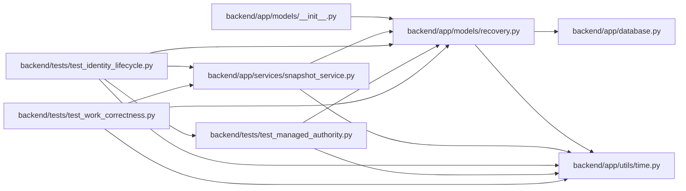

# recovery Module

**Path:** `backend/app/models/recovery.py`

## Description

Transactional application recovery points and explicit schedule commitments.

Application snapshots and their legacy provenance inventory live in the database. Schedule baseline history records explicit commitments separately from mutable forecasts and actual UTC events. These records support scoped application recovery and are not a substitute for a complete database backup.

## Imports

| Source | Symbols |
|--------|---------|
| `app.database` | `Base` |
| `app.utils.time` | `UTCDateTime`, `utc_now` |
| `datetime` | `date`, `datetime` |
| `sqlalchemy` | `ForeignKey`, `Integer`, `JSON`, `String`, `Text`, `UniqueConstraint`, `Date` |
| `sqlalchemy.orm` | `Mapped`, `mapped_column` |

## Local dependency map

<!-- Auto-generated local dependency summary. Do not edit by hand. -->

### Internal neighbors

| Direction | Module |
|---|---|
| Inbound | [models___init__](../modules/models___init__.md) |
| Inbound | [snapshot_service](../modules/snapshot_service.md) |
| Inbound | [test_identity_lifecycle](../modules/test_identity_lifecycle.md) |
| Inbound | [test_managed_authority](../modules/test_managed_authority.md) |
| Inbound | [test_work_correctness](../modules/test_work_correctness.md) |
| Outbound | [app_database](../modules/app_database.md) |
| Outbound | [time](../modules/time.md) |

### External packages

| Language | Used packages | Undeclared packages |
|---|---:|---:|
| python | 1 | 0 |

## Classes

| Class | Line | Bases | Description |
|-------|------|-------|-------------|
| [ApplicationSnapshot](../entities/ApplicationSnapshot.md) | 12 | `Base` | — |
| [LegacySnapshotImport](../entities/LegacySnapshotImport.md) | 27 | `Base` | — |
| [TaskScheduleBaseline](../entities/TaskScheduleBaseline.md) | 37 | `Base` | — |
