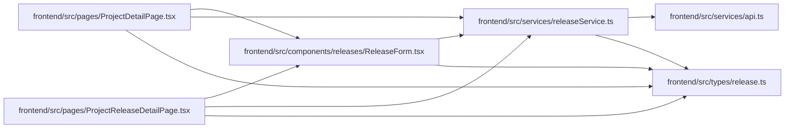

# releaseService Module

**Path:** `frontend/src/services/releaseService.ts`

## Description

_Auto-generated from `frontend/src/services/releaseService.ts`._

## Imports

| Source | Symbols |
|--------|---------|
| `../types/release` | `Release`, `ReleaseCreateRequest`, `ReleaseUpdateRequest` |
| `./api` | `api` |

## Module Signals

| Signal | Values |
|--------|--------|
| Exports | `releaseService` |
| Constants | `releaseService` |

## Local dependency map

<!-- Auto-generated local dependency summary. Do not edit by hand. -->

### Internal neighbors

| Direction | Module |
|---|---|
| Inbound | [ReleaseForm](../modules/ReleaseForm.md) |
| Inbound | [ProjectDetailPage](../modules/ProjectDetailPage.md) |
| Inbound | [ProjectReleaseDetailPage](../modules/ProjectReleaseDetailPage.md) |
| Outbound | [api](../modules/api.md) |
| Outbound | [types_release](../modules/types_release.md) |
