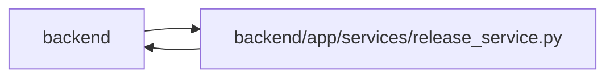

# release_service Module

**Path:** `backend/app/services/release_service.py`

## Description

Release service for project-scoped shipping records.

## Imports

| Source | Symbols |
|--------|---------|
| `app.commands` | `commit_or_flush` |
| `app.models.agent` | `TaskEvent` |
| `app.models.project` | `Project` |
| `app.models.release` | `Release`, `ReleaseStatus` |
| `app.models.task` | `Task` |
| `app.query_limits` | `CollectionLimitExceededError`, `MAX_BOUNDED_LIST_ITEMS` |
| `app.schemas.release` | `ReleaseCreateRequest`, `ReleaseUpdateRequest` |
| `app.services.outbound_webhook_service` | `emit_outbound_webhook_event` |
| `app.services.task_service` | `TaskService` |
| `app.utils.time` | `utc_now` |
| `datetime` | `datetime` |
| `sqlalchemy` | `select` |
| `sqlalchemy.ext.asyncio` | `AsyncSession` |
| `sqlalchemy.orm` | `selectinload` |
| `typing` | `Optional`, `Sequence` |

## Local dependency map

<!-- Auto-generated local dependency summary. Do not edit by hand. -->

> Module-level dependencies exceed the generated-diagram limits, so the diagram and table below group them by top-level package. Counts report the number of module neighbors in each package.

### Internal neighbors

| Direction | Module |
|---|---|
| Inbound | `backend` (2) |
| Outbound | `backend` (10) |

### External packages

| Language | Used packages | Undeclared packages |
|---|---:|---:|
| python | 1 | 0 |

> All 12 module neighbor(s) are summarized by package because the module-level view exceeds the 12-node limit.

## Classes

| Class | Line | Bases | Description |
|-------|------|-------|-------------|
| [ReleaseService](../entities/ReleaseService.md) | 25 | — | Service for release CRUD and task link validation. |
