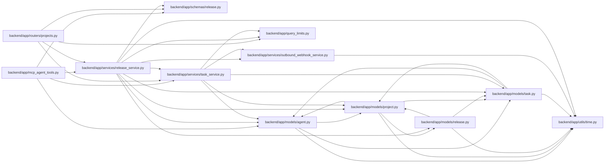

# release_service Module

**Path:** `backend/app/services/release_service.py`

## Description

Release service for project-scoped shipping records.

## Imports

| Source | Symbols |
|--------|---------|
| `app.models.agent` | `TaskEvent` |
| `app.models.project` | `Project` |
| `app.models.release` | `Release`, `ReleaseStatus` |
| `app.models.task` | `Task` |
| `app.query_limits` | `CollectionLimitExceededError`, `MAX_BOUNDED_LIST_ITEMS` |
| `app.schemas.release` | `ReleaseCreateRequest`, `ReleaseUpdateRequest` |
| `app.services.outbound_webhook_service` | `emit_outbound_webhook_event` |
| `app.services.task_service` | `TaskService` |
| `app.utils.time` | `utc_now` |
| `datetime` | `datetime` |
| `sqlalchemy` | `select` |
| `sqlalchemy.ext.asyncio` | `AsyncSession` |
| `sqlalchemy.orm` | `selectinload` |
| `typing` | `Optional`, `Sequence` |

## Local dependency map

<!-- Auto-generated local dependency summary. Do not edit by hand. -->

### Internal neighbors

| Direction | Module |
|---|---|
| Inbound | [mcp_agent_tools](../modules/mcp_agent_tools.md) |
| Inbound | [projects](../modules/projects.md) |
| Outbound | [models_agent](../modules/models_agent.md) |
| Outbound | [models_project](../modules/models_project.md) |
| Outbound | [models_release](../modules/models_release.md) |
| Outbound | [models_task](../modules/models_task.md) |
| Outbound | [query_limits](../modules/query_limits.md) |
| Outbound | [schemas_release](../modules/schemas_release.md) |
| Outbound | [outbound_webhook_service](../modules/outbound_webhook_service.md) |
| Outbound | [task_service](../modules/task_service.md) |
| Outbound | [time](../modules/time.md) |

### External packages

| Language | Used packages | Undeclared packages |
|---|---:|---:|
| python | 1 | 0 |

## Classes

| Class | Line | Bases | Description |
|-------|------|-------|-------------|
| [ReleaseService](../entities/ReleaseService.md) | 23 | — | Service for release CRUD and task link validation. |
