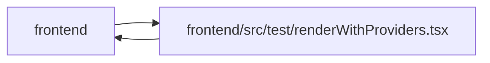

# renderWithProviders Module

**Path:** `frontend/src/test/renderWithProviders.tsx`

## Description

_Auto-generated from `frontend/src/test/renderWithProviders.tsx`._

## Imports

| Source | Symbols |
|--------|---------|
| `../components/feedback/ToastProvider` | `ToastProvider` |
| `@tanstack/react-query` | `QueryClient`, `QueryClientProvider` |
| `@testing-library/react` | `render`, `RenderOptions` |
| `@testing-library/user-event` | `userEvent` |
| `react` | `ReactElement`, `ReactNode` |
| `react-router-dom` | `MemoryRouter` |

## Module Signals

| Signal | Values |
|--------|--------|
| Exports | `createTestQueryClient`, `renderWithProviders` |

## Local dependency map

<!-- Auto-generated local dependency summary. Do not edit by hand. -->

> Module-level dependencies exceed the generated-diagram limits, so the diagram and table below group them by top-level package. Counts report the number of module neighbors in each package.

### Internal neighbors

| Direction | Module |
|---|---|
| Inbound | `frontend` (50) |
| Outbound | `frontend` (1) |

### External packages

| Language | Used packages | Undeclared packages |
|---|---:|---:|
| typescript | 5 | 0 |

> All 51 module neighbor(s) are summarized by package because the module-level view exceeds the 12-node limit.

## Classes

| Class | Kind | Line | Bases / Target | Description |
|-------|------|------|----------------|-------------|
| [RenderWithProvidersOptions](../entities/RenderWithProvidersOptions.md) | Class | 20 | `Omit` | — |

## Functions

| Function | Signature | Decorators | Description |
|----------|-----------|------------|-------------|
| `createTestQueryClient` | `()` | — | — |
| `renderWithProviders` | `(ui: ReactElement, {         initialEntries = ['/'],         queryClient = createTestQueryClient(),         ...renderOptions     }: RenderWithProvidersOptions = {})` | — | — |
