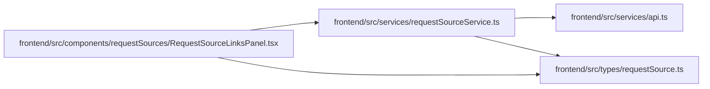

# requestSourceService Module

**Path:** `frontend/src/services/requestSourceService.ts`

## Description

_Auto-generated from `frontend/src/services/requestSourceService.ts`._

## Imports

| Source | Symbols |
|--------|---------|
| `../types/requestSource` | `RequestSource`, `RequestSourceLinkCreate`, `RequestSourceLinkWithSource`, `RequestSourceTargetType`, `RequestSourceType` |
| `./api` | `api` |

## Module Signals

| Signal | Values |
|--------|--------|
| Exports | `requestSourceService` |
| Constants | `requestSourceService` |

## Local dependency map

<!-- Auto-generated local dependency summary. Do not edit by hand. -->

### Internal neighbors

| Direction | Module |
|---|---|
| Inbound | [RequestSourceLinksPanel](../modules/RequestSourceLinksPanel.md) |
| Outbound | [api](../modules/api.md) |
| Outbound | [requestSource](../modules/requestSource.md) |
