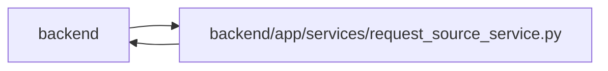

# request_source_service Module

**Path:** `backend/app/services/request_source_service.py`

## Description

Helpers for request source traceability.

## Imports

| Source | Symbols |
|--------|---------|
| `app.models.project` | `Project` |
| `app.models.request_source` | `RequestSource`, `RequestSourceLink`, `RequestSourceType` |
| `app.models.task` | `Task` |
| `app.models.triage` | `TriageItem` |
| `app.schemas.request_source` | `RequestSourceCreate`, `RequestSourceLinkCreateRequest`, `RequestSourceTargetType` |
| `app.services.outbound_webhook_service` | `emit_outbound_webhook_event` |
| `app.services.task_context_revision_service` | `reserve_task_context_revision` |
| `app.sql_semantics` | `portable_contains` |
| `sqlalchemy` | `func`, `or_`, `select` |
| `sqlalchemy.exc` | `IntegrityError` |
| `sqlalchemy.ext.asyncio` | `AsyncSession` |
| `sqlalchemy.orm` | `selectinload` |
| `typing` | `Optional`, `Sequence` |

## Local dependency map

<!-- Auto-generated local dependency summary. Do not edit by hand. -->

> Module-level dependencies exceed the generated-diagram limits, so the diagram and table below group them by top-level package. Counts report the number of module neighbors in each package.

### Internal neighbors

| Direction | Module |
|---|---|
| Inbound | `backend` (4) |
| Outbound | `backend` (8) |

### External packages

| Language | Used packages | Undeclared packages |
|---|---:|---:|
| python | 1 | 0 |

> All 12 module neighbor(s) are summarized by package because the module-level view exceeds the 12-node limit.

## Classes

| Class | Line | Bases | Description |
|-------|------|-------|-------------|
| [RequestSourceValidationError](../entities/RequestSourceValidationError.md) | 23 | `ValueError` | Raised when request-source input is invalid. |
| [RequestSourceNotFoundError](../entities/RequestSourceNotFoundError.md) | 27 | `LookupError` | Raised when a request source or link cannot be found. |
| [RequestSourceTargetNotFoundError](../entities/RequestSourceTargetNotFoundError.md) | 31 | `LookupError` | Raised when a requested link target cannot be found. |
| [RequestSourceConflictError](../entities/RequestSourceConflictError.md) | 35 | `ValueError` | Raised when a source is already linked to the target. |
| [RequestSourceService](../entities/RequestSourceService.md) | 39 | — | Small service for direct request-source link counts. |
