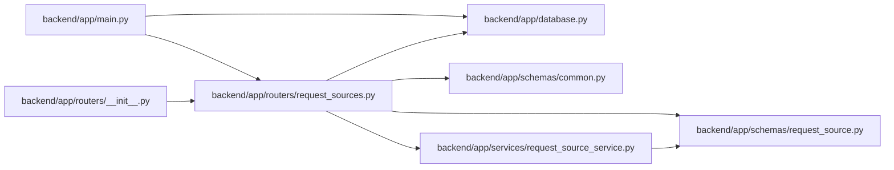

# request_sources Module

**Path:** `backend/app/routers/request_sources.py`

## Description

Request source linking API router.

## Imports

| Source | Symbols |
|--------|---------|
| `app.database` | `get_db` |
| `app.schemas.common` | `MessageResponse` |
| `app.schemas.request_source` | `RequestSourceLinkCreateRequest`, `RequestSourceLinkWithSourceResponse`, `RequestSourceResponse` |
| `app.services.request_source_service` | `RequestSourceConflictError`, `RequestSourceNotFoundError`, `RequestSourceService`, `RequestSourceTargetNotFoundError`, `RequestSourceValidationError` |
| `fastapi` | `APIRouter`, `Body`, `Depends`, `HTTPException`, `Query`, `status` |
| `pydantic` | `ValidationError` |
| `sqlalchemy.ext.asyncio` | `AsyncSession` |
| `typing` | `Annotated`, `Optional` |

## Local dependency map

<!-- Auto-generated local dependency summary. Do not edit by hand. -->

### Internal neighbors

| Direction | Module |
|---|---|
| Inbound | [app_main](../modules/app_main.md) |
| Inbound | [routers___init__](../modules/routers___init__.md) |
| Outbound | [app_database](../modules/app_database.md) |
| Outbound | [schemas_common](../modules/schemas_common.md) |
| Outbound | [schemas_request_source](../modules/schemas_request_source.md) |
| Outbound | [request_source_service](../modules/request_source_service.md) |

### External packages

| Language | Used packages | Undeclared packages |
|---|---:|---:|
| python | 3 | 0 |

## Functions

| Function | Signature | Decorators | Description |
|----------|-----------|------------|-------------|
| `get_request_source_service` | *(async)* `(db: Annotated[AsyncSession, Depends(get_db, scope='function')]) -> RequestSourceService` | — | Dependency for request-source service. |
| `_bad_request` | `(error: Exception) -> HTTPException` | — | — |
| `_not_found` | `(error: Exception) -> HTTPException` | — | — |
| `search_request_sources` | *(async)* `(service: Annotated[RequestSourceService, Depends(get_request_source_service)], q: Optional[str] = Query(None, min_length=1), source_type: Optional[str] = Query(None), limit: int = Query(20, ge=1, le=100))` | `@router.get('/request-sources', response_model=list[RequestSourceResponse])` | Search request sources for linking. |
| `list_request_source_links` | *(async)* `(service: Annotated[RequestSourceService, Depends(get_request_source_service)], target_type: str = Query(...), target_id: int = Query(..., gt=0))` | `@router.get('/request-source-links', response_model=list[RequestSourceLinkWithSourceResponse])` | List request-source links for one target. |
| `create_request_source_link` | *(async)* `(raw_data: Annotated[dict, Body(...)], service: Annotated[RequestSourceService, Depends(get_request_source_service)])` | `@router.post('/request-source-links', response_model=RequestSourceLinkWithSourceResponse, status_code=status.HTTP_201_CREATED)` | Create a request source and link, or link an existing source. |
| `delete_request_source_link` | *(async)* `(link_id: int, service: Annotated[RequestSourceService, Depends(get_request_source_service)])` | `@router.delete('/request-source-links/{link_id}', response_model=MessageResponse)` | Unlink a request source from a target. |
