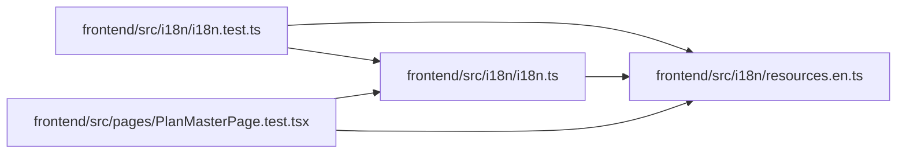

# resources.en Module

**Path:** `frontend/src/i18n/resources.en.ts`

## Description

_Auto-generated from `frontend/src/i18n/resources.en.ts`._

## Module Signals

| Signal | Values |
|--------|--------|
| Exports | `englishResources` |
| Constants | `englishResources` |

## Local dependency map

<!-- Auto-generated local dependency summary. Do not edit by hand. -->

### Internal neighbors

| Direction | Module |
|---|---|
| Inbound | [i18n.test](../modules/i18n.test.md) |
| Inbound | [i18n](../modules/i18n.md) |
| Inbound | [PlanMasterPage.test](../modules/PlanMasterPage.test.md) |
