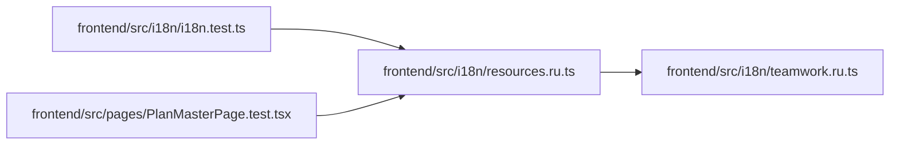

# resources.ru Module

**Path:** `frontend/src/i18n/resources.ru.ts`

## Description

_Auto-generated from `frontend/src/i18n/resources.ru.ts`._

## Imports

| Source | Symbols |
|--------|---------|
| `./teamwork.ru` | `teamworkRussian` |

## Module Signals

| Signal | Values |
|--------|--------|
| Exports | `russianResources` |
| Constants | `russianResources` |

## Local dependency map

<!-- Auto-generated local dependency summary. Do not edit by hand. -->

### Internal neighbors

| Direction | Module |
|---|---|
| Inbound | [i18n.test](../modules/i18n.test.md) |
| Inbound | [PlanMasterPage.test](../modules/PlanMasterPage.test.md) |
| Outbound | [teamwork.ru](../modules/teamwork.ru.md) |
