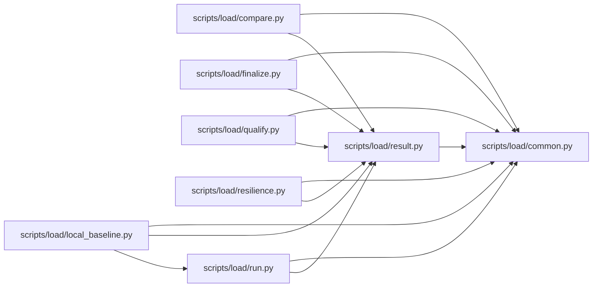

# result Module

**Path:** `scripts/load/result.py`

## Description

Build, validate, and evaluate machine-readable load result documents.

## Imports

| Source | Symbols |
|--------|---------|
| `__future__` | `annotations` |
| `collections` | `Counter`, `defaultdict` |
| `jsonschema` | `Draft202012Validator`, `FormatChecker` |
| `math` | `math` |
| `pathlib` | `Path` |
| `scripts.load.common` | `LOAD_RESULT_SCHEMA_MEMBER`, `QualificationInputError`, `atomic_write_json`, `capacity_contract`, `contract_member_json`, `traffic_profile`, `verify_document` |
| `typing` | `Any`, `Iterable`, `Mapping` |

## Local dependency map

<!-- Auto-generated local dependency summary. Do not edit by hand. -->

### Internal neighbors

| Direction | Module |
|---|---|
| Inbound | [compare](../modules/compare.md) |
| Inbound | [finalize](../modules/finalize.md) |
| Inbound | [local_baseline](../modules/local_baseline.md) |
| Inbound | [qualify](../modules/qualify.md) |
| Inbound | [resilience](../modules/resilience.md) |
| Inbound | [run](../modules/run.md) |
| Outbound | [load_common](../modules/load_common.md) |

### External packages

| Language | Used packages | Undeclared packages |
|---|---:|---:|
| python | 1 | 1 |

## Functions

| Function | Signature | Decorators | Description |
|----------|-----------|------------|-------------|
| `percentile` | `(values: Iterable[float], quantile: float) -> float` | — | — |
| `latency_summary` | `(values: Iterable[float]) -> dict[str, float]` | — | — |
| `measurement` | `(latencies: Iterable[float], statuses: Iterable[int]) -> dict[str, Any]` | — | — |
| `validate_result` | `(document: Mapping[str, Any], *, verify_checksum: bool = True) -> None` | — | — |
| `_gate` | `(status: str, *, actual: Any, required: Any, reason: str) -> dict[str, Any]` | — | — |
| `_maximum_gate` | `(name: str, actual: float, maximum: float) -> tuple[str, dict[str, Any]]` | — | — |
| `_minimum_gate` | `(name: str, actual: float, minimum: float) -> tuple[str, dict[str, Any]]` | — | — |
| `evaluate_client_gates` | `(document: Mapping[str, Any]) -> dict[str, dict[str, Any]]` | — | — |
| `evaluate_external_gates` | `(external_metrics: Mapping[str, Any], integrity: Mapping[str, Any]) -> dict[str, dict[str, Any]]` | — | Evaluate every non-client SLO from explicit deployment evidence. |
| `evaluate_workload_gates` | `(document: Mapping[str, Any]) -> dict[str, dict[str, Any]]` | — | Reject a live run that drifted from non-endpoint workload semantics. |
| `result_status` | `(gates: Mapping[str, Mapping[str, Any]], *, qualification_candidate: bool) -> str` | — | — |
| `write_result` | `(path: Path, payload: Mapping[str, Any]) -> dict[str, Any]` | — | — |
