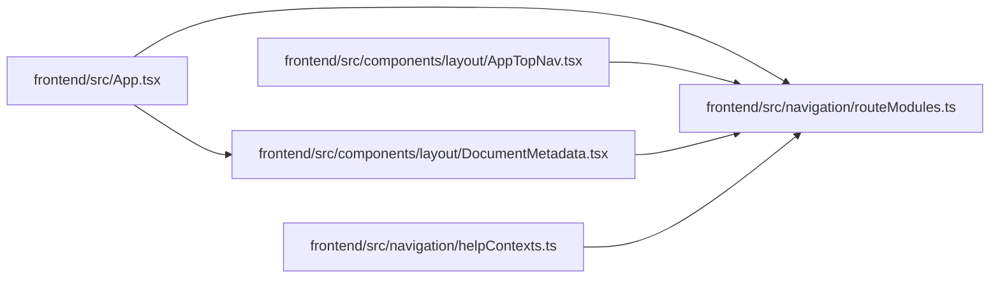

# routeModules Module

**Path:** `frontend/src/navigation/routeModules.ts`

## Description

_Auto-generated from `frontend/src/navigation/routeModules.ts`._

## Imports

| Source | Symbols |
|--------|---------|
| `react-router-dom` | `matchPath` |

## Module Signals

| Signal | Values |
|--------|--------|
| Exports | `RouteModuleKey`, `metadataForPath`, `routeMetadata`, `routeModuleLoaders`, `warmRouteModule` |
| Constants | `routeModuleLoaders`, `routeMetadata` |

## Local dependency map

<!-- Auto-generated local dependency summary. Do not edit by hand. -->

### Internal neighbors

| Direction | Module |
|---|---|
| Inbound | [App](../modules/App.md) |
| Inbound | [AppTopNav](../modules/AppTopNav.md) |
| Inbound | [DocumentMetadata](../modules/DocumentMetadata.md) |
| Inbound | [helpContexts](../modules/helpContexts.md) |

### External packages

| Language | Used packages | Undeclared packages |
|---|---:|---:|
| typescript | 1 | 0 |

## Classes

| Class | Kind | Line | Bases / Target | Description |
|-------|------|------|----------------|-------------|
| [RouteModuleKey](../entities/RouteModuleKey.md) | Type alias | 26 | — | — |
| [RouteMetadata](../entities/RouteMetadata.md) | Type alias | 28 | — | — |

## Functions

| Function | Signature | Decorators | Description |
|----------|-----------|------------|-------------|
| `metadataForPath` | `(pathname: string) -> RouteMetadata` | — | — |
| `warmRouteModule` | *(async)* `(pathname: string)` | — | — |
