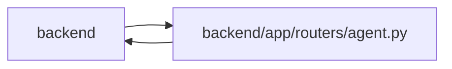

# agent Module

**Path:** `backend/app/routers/agent.py`

## Description

Agent integration API router.

## Imports

| Source | Symbols |
|--------|---------|
| `app.agent_contract` | `agent_contract_features` |
| `app.config` | `get_settings` |
| `app.database` | `get_db` |
| `app.models.agent` | `AgentActor` |
| `app.models.team_member` | `TeamMemberProfile` |
| `app.routers.agent_skill_bundles` | `get_agent_skill_bundle_service` |
| `app.schemas.agent` | `AgentActorCreate`, `AgentActorCreatedResponse`, `AgentActorRosterItem`, `AgentActorResponse`, `AgentActorUpdate`, `AgentDiscoveryTriageCreate`, `AgentDiscoveryTriageResponse`, `AgentCapabilitiesResponse`, `AgentReviewVerdict`, `AgentReviewVerdictResponse`, `AgentReviewQueueResponse`, `AgentRecoveryListResponse`, `AgentRecoveryRequeue`, `AgentRecoveryRequeueResponse`, `AgentRunCreate`, `AgentRunEventCreate`, `AgentRunEventResponse`, `AgentRunFinish`, `AgentRunResponse`, `AgentTaskAssignmentCreate`, `AgentTaskAssignmentResponse`, `AgentTaskAssignmentUpdate`, `AgentTaskContextResponse`, `AgentTaskCreate`, `AgentTaskPatch`, `AgentWorkBegin`, `AgentWorkBeginResponse`, `AgentWorkDecisionResponse`, `AgentWorkRenew`, `AgentWorkSubmit`, `AgentWorkTerminal`, `AgentWorkTerminalResponse`, `ModelAwareAgentTaskAssignmentCreate`, `ModelAwareAgentTaskAssignmentUpdate`, `ModelAwareAgentWorkBegin`, `TaskClaimRequest`, `TaskClaimResponse`, `TaskEventCreate`, `TaskEventResponse`, `AgentPipelineResponse`, `AgentProjectUpdateCreate`, `AgentProjectUpdateResponse`, `AgentRunDetailResponse` |
| `app.schemas.agent_planning` | `AgentPlanningCommandContext` |
| `app.schemas.agent_routing` | `AgentRoutingPreviewCreate`, `AgentRoutingPreviewResponse` |
| `app.schemas.agent_skill_bundle` | `SkillBundleCatalogResponse` |
| `app.schemas.agent_team_setup` | `AgentTeamApplyRequest`, `AgentTeamApplyResponse`, `AgentTeamManifestRequest`, `AgentTeamPlanRequest`, `AgentTeamReconciliationPlan`, `AgentTeamRuntimeAcknowledgement`, `AgentTeamRuntimeAcknowledgementResponse`, `AgentTeamSetupReport`, `AgentTeamStatusResponse`, `AgentTeamValidateResponse` |
| `app.schemas.common` | `MessageResponse` |
| `app.schemas.execution_usage` | `ExecutionUsageResponse`, `ExecutionUsageWrite` |
| `app.schemas.task` | `TaskResponse` |
| `app.security` | `ADMIN_API_KEY_HEADER`, `admin_api_key_is_valid` |
| `app.services.agent_routing_rollout` | `AgentRoutingRolloutService`, `AgentRoutingTopologyReadinessStatus` |
| `app.services.agent_routing_service` | `AgentRoutingConflictError`, `AgentRoutingService` |
| `app.services.agent_service` | `AgentConflictError`, `AgentPermissionError`, `AgentService`, `actor_has_scope`, `actor_scopes`, `require_scope` |
| `app.services.agent_skill_bundle_service` | `AgentSkillBundleService`, `SkillBundleArtifactError` |
| `app.services.agent_team_setup_service` | `AgentTeamSetupConflictError`, `AgentTeamSetupService` |
| `app.services.agent_work_service` | `AgentWorkService` |
| `app.services.execution_usage_service` | `ExecutionUsageService` |
| `app.services.task_domain_service` | `domain_capabilities` |
| `app.services.task_service` | `TaskVersionConflictError` |
| `app.utils.time` | `utc_now` |
| `fastapi` | `APIRouter`, `Depends`, `Header`, `HTTPException`, `Query`, `Request`, `Response`, `status` |
| `json` | `json` |
| `logging` | `logging` |
| `sqlalchemy.ext.asyncio` | `AsyncSession` |
| `typing` | `Annotated`, `Any`, `NoReturn`, `Optional` |

## Local dependency map

<!-- Auto-generated local dependency summary. Do not edit by hand. -->

> Module-level dependencies exceed the generated-diagram limits, so the diagram and table below group them by top-level package. Counts report the number of module neighbors in each package.

### Internal neighbors

| Direction | Module |
|---|---|
| Inbound | `backend` (9) |
| Outbound | `backend` (25) |

### External packages

| Language | Used packages | Undeclared packages |
|---|---:|---:|
| python | 2 | 0 |

> All 34 module neighbor(s) are summarized by package because the module-level view exceeds the 12-node limit.

## Functions

| Function | Signature | Decorators | Description |
|----------|-----------|------------|-------------|
| `_if_none_match_matches` | `(value: Optional[str], etag: str) -> bool` | — | Apply weak If-None-Match comparison for a GET representation. |
| `get_agent_service` | *(async)* `(db: Annotated[AsyncSession, Depends(get_db, scope='function')]) -> AgentService` | — | Dependency for agent service. |
| `get_agent_work_service` | *(async)* `(db: Annotated[AsyncSession, Depends(get_db, scope='function')]) -> AgentWorkService` | — | Dependency for durable assignment and worker lifecycle operations. |
| `get_agent_routing_service` | *(async)* `(db: Annotated[AsyncSession, Depends(get_db, scope='function')]) -> AgentRoutingService` | — | Dependency for deterministic model-aware routing operations. |
| `get_agent_team_setup_service` | *(async)* `(db: Annotated[AsyncSession, Depends(get_db, scope='function')]) -> AgentTeamSetupService` | — | Dependency for manifest-driven agent-team setup operations. |
| `get_agent_actor` | *(async)* `(service: Annotated[AgentService, Depends(get_agent_service)], api_key: Annotated[Optional[str], Header(alias='X-Agent-API-Key')] = None) -> AgentActor` | — | Authenticate an agent API key. |
| `_admin_header_actor` | `() -> AgentActor` | — | Build a transient actor for authenticated human control-plane access. |
| `get_agent_admin_actor` | *(async)* `(service: Annotated[AgentService, Depends(get_agent_service)], agent_api_key: Annotated[Optional[str], Header(alias='X-Agent-API-Key')] = None, admin_api_key: Annotated[Optional[str], Header(alias=ADMIN_API_KEY_HEADER)] = None) -> AgentActor` | — | Authenticate a stored admin actor, bootstrap provisioning key, or admin API key. |
| `require_agent_read_access` | *(async)* `(service: Annotated[AgentService, Depends(get_agent_service)], agent_api_key: Annotated[Optional[str], Header(alias='X-Agent-API-Key')] = None, admin_api_key: Annotated[Optional[str], Header(alias=ADMIN_API_KEY_HEADER)] = None) -> None` | — | Allow pipeline reads from a configured admin key or scoped agent key. |
| `_handle_agent_error` | `(exc: Exception, *, structured: bool = False) -> NoReturn` | — | Convert service errors to HTTP errors. |
| `_claim_response` | `(service: AgentService, task) -> TaskClaimResponse` | — | — |
| `_actor_response` | `(actor: AgentActor) -> AgentActorResponse` | — | — |
| `get_agent_capabilities` | *(async)* `(request: Request, actor: Annotated[AgentActor, Depends(get_agent_actor)], service: Annotated[AgentWorkService, Depends(get_agent_work_service)], bundle_service: Annotated[AgentSkillBundleService, Depends(get_agent_skill_bundle_service)])` | `@router.get('/agent/capabilities', response_model=AgentCapabilitiesResponse)` | Return the authenticated actor and supported agent contract features. |
| `validate_agent_team_master` | *(async)* `(data: AgentTeamManifestRequest, actor: Annotated[AgentActor, Depends(get_agent_admin_actor)], service: Annotated[AgentTeamSetupService, Depends(get_agent_team_setup_service)])` | `@router.post('/agent/team-setup/validate', response_model=AgentTeamValidateResponse)` | Validate a secret-free master and current package/server compatibility. |
| `plan_agent_team_reconciliation` | *(async)* `(data: AgentTeamPlanRequest, actor: Annotated[AgentActor, Depends(get_agent_admin_actor)], service: Annotated[AgentTeamSetupService, Depends(get_agent_team_setup_service)])` | `@router.post('/agent/team-setup/plan', response_model=AgentTeamReconciliationPlan)` | Return the stable, digest-bound action set for one desired master. |
| `apply_agent_team_reconciliation` | *(async)* `(data: AgentTeamApplyRequest, response: Response, actor: Annotated[AgentActor, Depends(get_agent_admin_actor)], service: Annotated[AgentTeamSetupService, Depends(get_agent_team_setup_service)], idempotency_key: Annotated[str, Header(alias='Idempotency-Key')], rationale: Annotated[str, Header(alias='X-Agent-Rationale')], correlation_id: Annotated[str, Header(alias='X-Correlation-ID')])` | `@router.post('/agent/team-setup/apply', response_model=AgentTeamApplyResponse)` | Apply only the exact approved action IDs from the current plan. |
| `get_agent_team_setup_status` | *(async)* `(response: Response, actor: Annotated[AgentActor, Depends(get_agent_admin_actor)], service: Annotated[AgentTeamSetupService, Depends(get_agent_team_setup_service)], topology_key: Annotated[Optional[str], Query()] = None)` | `@router.get('/agent/team-setup/status', response_model=AgentTeamStatusResponse)` | Return backend-derived desired, configured, and runtime readiness. |
| `get_agent_team_setup_report` | *(async)* `(response: Response, actor: Annotated[AgentActor, Depends(get_agent_admin_actor)], service: Annotated[AgentTeamSetupService, Depends(get_agent_team_setup_service)], topology_key: Annotated[Optional[str], Query()] = None)` | `@router.get('/agent/team-setup/report', response_model=AgentTeamSetupReport)` | Export a bounded report derived from redacted authoritative status. |
| `acknowledge_agent_team_runtime` | *(async)* `(data: AgentTeamRuntimeAcknowledgement, response: Response, service: Annotated[AgentTeamSetupService, Depends(get_agent_team_setup_service)], api_key: Annotated[Optional[str], Header(alias='X-Agent-API-Key')] = None)` | `@router.post('/agent/team-setup/onboarding/acknowledge', response_model=AgentTeamRuntimeAcknowledgementResponse)` | Accept the restricted exact handoff acknowledgement during onboarding. |
| `create_agent_actor` | *(async)* `(data: AgentActorCreate, response: Response, actor: Annotated[AgentActor, Depends(get_agent_admin_actor)], service: Annotated[AgentService, Depends(get_agent_service)])` | `@router.post('/agent/actors', response_model=AgentActorCreatedResponse, status_code=status.HTTP_201_CREATED)` | Create an agent actor. Requires admin scope. |
| `list_agent_actors` | *(async)* `(actor: Annotated[AgentActor, Depends(get_agent_admin_actor)], service: Annotated[AgentWorkService, Depends(get_agent_work_service)], include_disabled: Annotated[bool, Query()] = False)` | `@router.get('/agent/actors', response_model=list[AgentActorRosterItem])` | Return the secret-free actor roster for scoped PM planning. |
| `update_agent_actor` | *(async)* `(actor_id: int, data: AgentActorUpdate, actor: Annotated[AgentActor, Depends(get_agent_admin_actor)], service: Annotated[AgentWorkService, Depends(get_agent_work_service)])` | `@router.patch('/agent/actors/{actor_id}', response_model=AgentActorResponse)` | Update non-secret actor policy and profile metadata. Requires admin scope. |
| `preview_task_routing` | *(async)* `(task_id: int, data: AgentRoutingPreviewCreate, actor: Annotated[AgentActor, Depends(get_agent_actor)], service: Annotated[AgentRoutingService, Depends(get_agent_routing_service)])` | `@router.post('/agent/tasks/{task_id}/routing-preview', response_model=AgentRoutingPreviewResponse)` | Preview candidates without mutating task or assignment state. |
| `create_agent_assignment` | *(async)* `(data: ModelAwareAgentTaskAssignmentCreate \| AgentTaskAssignmentCreate, actor: Annotated[AgentActor, Depends(get_agent_actor)], service: Annotated[AgentWorkService, Depends(get_agent_work_service)], idempotency_key: Annotated[str, Header(alias='Idempotency-Key')], rationale: Annotated[str, Header(alias='X-Agent-Rationale')], correlation_id: Annotated[str, Header(alias='X-Correlation-ID')])` | `@router.post('/agent/assignments', response_model=AgentTaskAssignmentResponse, status_code=status.HTTP_201_CREATED)` | Dispatch one task to an exact actor using PM assignment scope. |
| `list_agent_assignments` | *(async)* `(actor: Annotated[AgentActor, Depends(get_agent_actor)], service: Annotated[AgentWorkService, Depends(get_agent_work_service)], task_id: Optional[int] = Query(default=None, ge=1), actor_id: Optional[int] = Query(default=None, ge=1), purpose: Optional[str] = Query(default=None), state: Optional[str] = Query(default=None), limit: int = Query(default=200, ge=1, le=500))` | `@router.get('/agent/assignments', response_model=list[AgentTaskAssignmentResponse])` | List durable assignments within the caller's authorized queue boundary. |
| `update_agent_assignment` | *(async)* `(assignment_id: int, data: ModelAwareAgentTaskAssignmentUpdate \| AgentTaskAssignmentUpdate, actor: Annotated[AgentActor, Depends(get_agent_actor)], service: Annotated[AgentWorkService, Depends(get_agent_work_service)], idempotency_key: Annotated[str, Header(alias='Idempotency-Key')], rationale: Annotated[str, Header(alias='X-Agent-Rationale')], correlation_id: Annotated[str, Header(alias='X-Correlation-ID')])` | `@router.patch('/agent/assignments/{assignment_id}', response_model=AgentTaskAssignmentResponse)` | Reassign, reorder, or cancel queued work using PM assignment scope. |
| `list_ready_tasks` | *(async)* `(actor: Annotated[AgentActor, Depends(get_agent_actor)], service: Annotated[AgentService, Depends(get_agent_service)], iteration_id: Optional[int] = None, tags: Annotated[Optional[list[str]], Query()] = None, priority_min: Optional[int] = Query(None, ge=1, le=10), priority_max: Optional[int] = Query(None, ge=1, le=10), assignee_id: Optional[int] = None, capabilities: Annotated[Optional[list[str]], Query()] = None, limit: int = Query(50, ge=1, le=200))` | `@router.get('/agent/tasks/ready', response_model=list[TaskResponse])` | Return claimable tasks with satisfied dependencies. |
| `get_my_agent_work` | *(async)* `(actor: Annotated[AgentActor, Depends(get_agent_actor)], service: Annotated[AgentWorkService, Depends(get_agent_work_service)], response: Response, limit: int = Query(20, ge=1, le=200), cursor: Optional[str] = None, if_none_match: Annotated[Optional[str], Header(alias='If-None-Match')] = None)` | `@router.get('/agent/me/work', response_model=AgentWorkDecisionResponse)` | Return the server-authoritative resume, begin, wait, or recovery decision. |
| `list_my_agent_claims` | *(async)* `(actor: Annotated[AgentActor, Depends(get_agent_actor)], service: Annotated[AgentWorkService, Depends(get_agent_work_service)])` | `@router.get('/agent/me/claims', response_model=list[dict[str, Any]])` | Return claims currently owned by the authenticated actor. |
| `list_my_agent_runs` | *(async)* `(actor: Annotated[AgentActor, Depends(get_agent_actor)], service: Annotated[AgentWorkService, Depends(get_agent_work_service)], limit: int = Query(50, ge=1, le=200))` | `@router.get('/agent/me/runs', response_model=list[AgentRunResponse])` | Return recent runs owned by the authenticated actor. |
| `get_agent_task_context` | *(async)* `(task_id: int, actor: Annotated[AgentActor, Depends(get_agent_actor)], service: Annotated[AgentWorkService, Depends(get_agent_work_service)], assignment_id: Optional[int] = None)` | `@router.get('/agent/tasks/{task_id}/context', response_model=AgentTaskContextResponse)` | Return the complete assigned-task brief, dependencies, and timeline. |
| `begin_my_agent_work` | *(async)* `(data: ModelAwareAgentWorkBegin \| AgentWorkBegin, actor: Annotated[AgentActor, Depends(get_agent_actor)], service: Annotated[AgentWorkService, Depends(get_agent_work_service)], idempotency_key: Annotated[str, Header(alias='Idempotency-Key')])` | `@router.post('/agent/me/work/begin', response_model=AgentWorkBeginResponse)` | Atomically accept, fence, claim, run, and activate assigned work. |
| `submit_my_agent_work` | *(async)* `(data: AgentWorkSubmit, actor: Annotated[AgentActor, Depends(get_agent_actor)], service: Annotated[AgentWorkService, Depends(get_agent_work_service)], idempotency_key: Annotated[str, Header(alias='Idempotency-Key')])` | `@router.post('/agent/me/work/submit', response_model=AgentWorkTerminalResponse)` | Atomically submit evidence, resolve the task, and release assigned work. |
| `renew_my_agent_work` | *(async)* `(data: AgentWorkRenew, actor: Annotated[AgentActor, Depends(get_agent_actor)], service: Annotated[AgentWorkService, Depends(get_agent_work_service)], idempotency_key: Annotated[str, Header(alias='Idempotency-Key')])` | `@router.post('/agent/me/work/renew', response_model=AgentWorkBeginResponse)` | Renew the current assignment fence and run heartbeat atomically. |
| `fail_my_agent_work` | *(async)* `(data: AgentWorkTerminal, actor: Annotated[AgentActor, Depends(get_agent_actor)], service: Annotated[AgentWorkService, Depends(get_agent_work_service)], idempotency_key: Annotated[str, Header(alias='Idempotency-Key')])` | `@router.post('/agent/me/work/fail', response_model=AgentWorkTerminalResponse)` | Atomically finish failed/canceled work and signal PM recovery. |
| `get_my_agent_reviews` | *(async)* `(actor: Annotated[AgentActor, Depends(get_agent_actor)], service: Annotated[AgentWorkService, Depends(get_agent_work_service)], limit: int = Query(50, ge=1, le=200), cursor: Optional[str] = None)` | `@router.get('/agent/me/reviews', response_model=AgentReviewQueueResponse)` | Return verification-purpose assignments for the authenticated actor. |
| `submit_my_agent_review_verdict` | *(async)* `(data: AgentReviewVerdict, actor: Annotated[AgentActor, Depends(get_agent_actor)], service: Annotated[AgentWorkService, Depends(get_agent_work_service)], idempotency_key: Annotated[str, Header(alias='Idempotency-Key')], rationale: Annotated[str, Header(alias='X-Agent-Rationale')], correlation_id: Annotated[str, Header(alias='X-Correlation-ID')])` | `@router.post('/agent/me/reviews/verdict', response_model=AgentReviewVerdictResponse)` | Apply an independent pass/reject verdict and optional rework handoff. |
| `list_agent_recovery_tasks` | *(async)* `(actor: Annotated[AgentActor, Depends(get_agent_actor)], service: Annotated[AgentWorkService, Depends(get_agent_work_service)], limit: int = Query(50, ge=1, le=200), cursor: Optional[str] = None)` | `@router.get('/agent/recovery', response_model=AgentRecoveryListResponse)` | Return typed recovery diagnoses and exact optimistic ownership tuples. |
| `requeue_agent_recovery_task` | *(async)* `(task_id: int, data: AgentRecoveryRequeue, actor: Annotated[AgentActor, Depends(get_agent_actor)], service: Annotated[AgentWorkService, Depends(get_agent_work_service)], idempotency_key: Annotated[str, Header(alias='Idempotency-Key')], rationale: Annotated[str, Header(alias='X-Agent-Rationale')], correlation_id: Annotated[str, Header(alias='X-Correlation-ID')])` | `@router.post('/agent/recovery/{task_id}/requeue', response_model=AgentRecoveryRequeueResponse)` | Reconcile stale execution ownership and dispatch ordered recovery work. |
| `create_agent_project_update` | *(async)* `(project_id: int, data: AgentProjectUpdateCreate, actor: Annotated[AgentActor, Depends(get_agent_actor)], service: Annotated[AgentWorkService, Depends(get_agent_work_service)], idempotency_key: Annotated[str, Header(alias='Idempotency-Key')], rationale: Annotated[str, Header(alias='X-Agent-Rationale')], correlation_id: Annotated[str, Header(alias='X-Correlation-ID')])` | `@router.post('/agent/projects/{project_id}/updates', response_model=AgentProjectUpdateResponse, status_code=status.HTTP_201_CREATED)` | Append an evidence-backed project update with agent attribution. |
| `report_agent_discovery` | *(async)* `(data: AgentDiscoveryTriageCreate, actor: Annotated[AgentActor, Depends(get_agent_actor)], service: Annotated[AgentWorkService, Depends(get_agent_work_service)], idempotency_key: Annotated[str, Header(alias='Idempotency-Key')])` | `@router.post('/agent/discoveries', response_model=AgentDiscoveryTriageResponse, status_code=status.HTTP_201_CREATED)` | Report claim-bound out-of-scope work to PM-controlled Triage. |
| `claim_task` | *(async)* `(task_id: int, data: TaskClaimRequest, actor: Annotated[AgentActor, Depends(get_agent_actor)], service: Annotated[AgentService, Depends(get_agent_service)], idempotency_key: Annotated[Optional[str], Header(alias='Idempotency-Key')] = None)` | `@router.post('/agent/tasks/{task_id}/claim', response_model=TaskClaimResponse)` | Claim a task lease. |
| `renew_task_claim` | *(async)* `(task_id: int, data: TaskClaimRequest, actor: Annotated[AgentActor, Depends(get_agent_actor)], service: Annotated[AgentService, Depends(get_agent_service)], idempotency_key: Annotated[Optional[str], Header(alias='Idempotency-Key')] = None)` | `@router.post('/agent/tasks/{task_id}/renew', response_model=TaskClaimResponse)` | Renew a task lease. |
| `release_task_claim` | *(async)* `(task_id: int, actor: Annotated[AgentActor, Depends(get_agent_actor)], service: Annotated[AgentService, Depends(get_agent_service)], idempotency_key: Annotated[Optional[str], Header(alias='Idempotency-Key')] = None)` | `@router.post('/agent/tasks/{task_id}/release', response_model=TaskResponse)` | Release a task lease. |
| `create_agent_task` | *(async)* `(iteration_id: int, data: AgentTaskCreate, actor: Annotated[AgentActor, Depends(get_agent_actor)], service: Annotated[AgentService, Depends(get_agent_service)], idempotency_key: Annotated[Optional[str], Header(alias='Idempotency-Key')] = None)` | `@router.post('/agent/tasks', response_model=TaskResponse, status_code=status.HTTP_201_CREATED)` | Create a task on behalf of an agent. |
| `patch_agent_task` | *(async)* `(task_id: int, data: AgentTaskPatch, actor: Annotated[AgentActor, Depends(get_agent_actor)], service: Annotated[AgentService, Depends(get_agent_service)], idempotency_key: Annotated[Optional[str], Header(alias='Idempotency-Key')] = None)` | `@router.patch('/agent/tasks/{task_id}', response_model=TaskResponse)` | Patch a task with optimistic concurrency. |
| `append_task_event` | *(async)* `(task_id: int, data: TaskEventCreate, actor: Annotated[AgentActor, Depends(get_agent_actor)], service: Annotated[AgentService, Depends(get_agent_service)], idempotency_key: Annotated[Optional[str], Header(alias='Idempotency-Key')] = None)` | `@router.post('/agent/tasks/{task_id}/events', response_model=TaskEventResponse)` | Append a task checkpoint/progress event. |
| `start_agent_run` | *(async)* `(data: AgentRunCreate, actor: Annotated[AgentActor, Depends(get_agent_actor)], service: Annotated[AgentService, Depends(get_agent_service)], idempotency_key: Annotated[Optional[str], Header(alias='Idempotency-Key')] = None)` | `@router.post('/agent/runs', response_model=AgentRunResponse, status_code=status.HTTP_201_CREATED)` | Start an agent run trace. |
| `append_agent_run_event` | *(async)* `(run_id: int, data: AgentRunEventCreate, actor: Annotated[AgentActor, Depends(get_agent_actor)], service: Annotated[AgentService, Depends(get_agent_service)])` | `@router.post('/agent/runs/{run_id}/events', response_model=AgentRunEventResponse)` | Append an event to an agent run. |
| `finish_agent_run` | *(async)* `(run_id: int, data: AgentRunFinish, actor: Annotated[AgentActor, Depends(get_agent_actor)], service: Annotated[AgentService, Depends(get_agent_service)])` | `@router.post('/agent/runs/{run_id}/finish', response_model=AgentRunResponse)` | Finish an agent run trace. |
| `_run_response` | `(service: AgentService, run) -> AgentRunResponse` | — | — |
| `_run_detail_response` | `(service: AgentService, run) -> AgentRunDetailResponse` | — | — |
| `get_agent_pipeline` | *(async)* `(service: Annotated[AgentService, Depends(get_agent_service)], _: Annotated[None, Depends(require_agent_read_access)])` | `@router.get('/agent/pipeline', response_model=AgentPipelineResponse)` | Retrieve all current tasks grouped by their agent pipeline columns. |
| `get_agent_run_detail` | *(async)* `(run_id: int, service: Annotated[AgentService, Depends(get_agent_service)], _: Annotated[None, Depends(require_agent_read_access)])` | `@router.get('/agent/runs/{run_id}', response_model=AgentRunDetailResponse)` | Get the full details of an agent run including chronological trace events. |
| `get_execution_usage` | *(async)* `(run_id: int, actor: Annotated[AgentActor, Depends(get_agent_actor)], db: Annotated[AsyncSession, Depends(get_db, scope='function')])` | `@router.get('/agent/runs/{run_id}/usage', response_model=ExecutionUsageResponse \| None)` | — |
| `record_execution_usage` | *(async)* `(run_id: int, data: ExecutionUsageWrite, actor: Annotated[AgentActor, Depends(get_agent_actor)], db: Annotated[AsyncSession, Depends(get_db, scope='function')])` | `@router.post('/agent/runs/{run_id}/usage', response_model=ExecutionUsageResponse)` | — |
