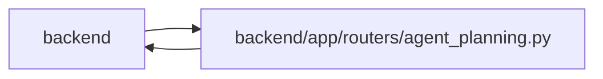

# agent_planning Module

**Path:** `backend/app/routers/agent_planning.py`

## Description

Agent-authenticated PM setup and schedule-control commands.

## Imports

| Source | Symbols |
|--------|---------|
| `app` | `mcp_agent_tools` |
| `app.database` | `get_db` |
| `app.models.agent` | `AgentActor` |
| `app.routers.agent` | `get_agent_actor` |
| `app.schemas.agent` | `AgentTaskCreate`, `AgentTaskPatch` |
| `app.schemas.agent_planning` | `AgentPlanningCommandContext`, `AgentPlanningReceipt`, `AgentScheduleCommand` |
| `app.schemas.agent_routing` | `TaskRoutingAssessmentCommand`, `TaskRoutingAssessmentListResponse`, `TaskRoutingAssessmentMutationReceipt`, `TaskRoutingAssessmentState` |
| `app.schemas.iteration` | `IterationCreate`, `IterationUpdate` |
| `app.schemas.project` | `ProjectCreate`, `ProjectMilestoneCreateRequest`, `ProjectMilestoneUpdate`, `ProjectUpdate` |
| `app.schemas.team` | `TeamMemberCreate`, `TeamMemberProfileCreate`, `TeamMemberProfileUpdate`, `TeamMemberUpdate`, `VacationCreate`, `VacationUpdate` |
| `app.schemas.triage` | `TriageActionRequest`, `TriageClassificationSuggestionResponse`, `TriageConvertToTaskRequest`, `TriageConvertToTaskResponse`, `TriageDuplicateRequest`, `TriageItemCreate`, `TriageItemResponse`, `TriageItemUpdate`, `TriageSnoozeRequest` |
| `app.services.agent_planning_service` | `AgentPlanningService` |
| `app.services.agent_routing_service` | `AgentRoutingConflictError`, `AgentRoutingService` |
| `app.services.agent_service` | `AgentConflictError`, `AgentPermissionError`, `require_scope` |
| `app.services.task_service` | `TaskVersionConflictError` |
| `app.services.triage_service` | `TriageConflictError` |
| `fastapi` | `APIRouter`, `Depends`, `Header`, `HTTPException`, `Query`, `status` |
| `sqlalchemy.ext.asyncio` | `AsyncSession` |
| `typing` | `Annotated`, `NoReturn` |

## Local dependency map

<!-- Auto-generated local dependency summary. Do not edit by hand. -->

> Module-level dependencies exceed the generated-diagram limits, so the diagram and table below group them by top-level package. Counts report the number of module neighbors in each package.

### Internal neighbors

| Direction | Module |
|---|---|
| Inbound | `backend` (5) |
| Outbound | `backend` (16) |

### External packages

| Language | Used packages | Undeclared packages |
|---|---:|---:|
| python | 2 | 0 |

> All 21 module neighbor(s) are summarized by package because the module-level view exceeds the 12-node limit.

## Functions

| Function | Signature | Decorators | Description |
|----------|-----------|------------|-------------|
| `get_agent_planning_service` | *(async)* `(db: Annotated[AsyncSession, Depends(get_db)]) -> AgentPlanningService` | — | Return the request-scoped PM setup command adapter. |
| `get_agent_routing_service` | *(async)* `(db: Annotated[AsyncSession, Depends(get_db)]) -> AgentRoutingService` | — | Return the request-scoped model-aware routing service. |
| `get_agent_planning_command_context` | *(async)* `(idempotency_key: Annotated[str, Header(alias='Idempotency-Key')], rationale: Annotated[str, Header(alias='X-Agent-Rationale')], correlation_id: Annotated[str, Header(alias='X-Correlation-ID')]) -> AgentPlanningCommandContext` | — | Validate required durable-audit headers for one PM command. |
| `_handle_agent_error` | `(exc: Exception) -> NoReturn` | — | Map safe command-domain errors to stable HTTP status codes. |
| `get_task_routing_assessment` | *(async)* `(task_id: int, actor: Annotated[AgentActor, Depends(get_agent_actor)], service: Annotated[AgentRoutingService, Depends(get_agent_routing_service)])` | `@router.get('/agent/planning/tasks/{task_id}/routing-assessment', response_model=TaskRoutingAssessmentState)` | Read the current task-version-bound routing assessment state. |
| `list_task_routing_assessments` | *(async)* `(task_id: int, actor: Annotated[AgentActor, Depends(get_agent_actor)], service: Annotated[AgentRoutingService, Depends(get_agent_routing_service)], limit: int = Query(default=100, ge=1, le=100))` | `@router.get('/agent/planning/tasks/{task_id}/routing-assessments', response_model=TaskRoutingAssessmentListResponse)` | List bounded append-only routing-assessment history newest first. |
| `create_task_routing_assessment` | *(async)* `(task_id: int, data: TaskRoutingAssessmentCommand, actor: Annotated[AgentActor, Depends(get_agent_actor)], service: Annotated[AgentRoutingService, Depends(get_agent_routing_service)], command: Annotated[AgentPlanningCommandContext, Depends(get_agent_planning_command_context)])` | `@router.post('/agent/planning/tasks/{task_id}/routing-assessment', response_model=TaskRoutingAssessmentMutationReceipt, status_code=status.HTTP_201_CREATED)` | Append one audited routing assessment for the expected task version. |
| `create_project` | *(async)* `(data: ProjectCreate, actor: Annotated[AgentActor, Depends(get_agent_actor)], service: Annotated[AgentPlanningService, Depends(get_agent_planning_service)], command: Annotated[AgentPlanningCommandContext, Depends(get_agent_planning_command_context)])` | `@router.post('/agent/planning/projects', response_model=AgentPlanningReceipt, status_code=status.HTTP_201_CREATED)` | Create a project through the planning domain service. |
| `update_project` | *(async)* `(project_id: int, data: ProjectUpdate, actor: Annotated[AgentActor, Depends(get_agent_actor)], service: Annotated[AgentPlanningService, Depends(get_agent_planning_service)], command: Annotated[AgentPlanningCommandContext, Depends(get_agent_planning_command_context)])` | `@router.patch('/agent/planning/projects/{project_id}', response_model=AgentPlanningReceipt)` | Partially update a project through the planning domain service. |
| `create_project_milestone` | *(async)* `(project_id: int, data: ProjectMilestoneCreateRequest, actor: Annotated[AgentActor, Depends(get_agent_actor)], service: Annotated[AgentPlanningService, Depends(get_agent_planning_service)], command: Annotated[AgentPlanningCommandContext, Depends(get_agent_planning_command_context)])` | `@router.post('/agent/planning/projects/{project_id}/milestones', response_model=AgentPlanningReceipt, status_code=status.HTTP_201_CREATED)` | Create one project-scoped milestone through the planning service. |
| `update_project_milestone` | *(async)* `(project_id: int, milestone_id: int, data: ProjectMilestoneUpdate, actor: Annotated[AgentActor, Depends(get_agent_actor)], service: Annotated[AgentPlanningService, Depends(get_agent_planning_service)], command: Annotated[AgentPlanningCommandContext, Depends(get_agent_planning_command_context)])` | `@router.patch('/agent/planning/projects/{project_id}/milestones/{milestone_id}', response_model=AgentPlanningReceipt)` | Update one milestone inside its project scope. |
| `delete_project_milestone` | *(async)* `(project_id: int, milestone_id: int, actor: Annotated[AgentActor, Depends(get_agent_actor)], service: Annotated[AgentPlanningService, Depends(get_agent_planning_service)], command: Annotated[AgentPlanningCommandContext, Depends(get_agent_planning_command_context)])` | `@router.delete('/agent/planning/projects/{project_id}/milestones/{milestone_id}', response_model=AgentPlanningReceipt)` | Delete one milestone while retaining an exact detachment receipt. |
| `create_planning_task` | *(async)* `(iteration_id: int, data: AgentTaskCreate, actor: Annotated[AgentActor, Depends(get_agent_actor)], service: Annotated[AgentPlanningService, Depends(get_agent_planning_service)], command: Annotated[AgentPlanningCommandContext, Depends(get_agent_planning_command_context)])` | `@router.post('/agent/planning/iterations/{iteration_id}/tasks', response_model=AgentPlanningReceipt, status_code=status.HTTP_201_CREATED)` | Create one decomposed task with complete PM command metadata. |
| `patch_planning_task` | *(async)* `(task_id: int, data: AgentTaskPatch, actor: Annotated[AgentActor, Depends(get_agent_actor)], service: Annotated[AgentPlanningService, Depends(get_agent_planning_service)], command: Annotated[AgentPlanningCommandContext, Depends(get_agent_planning_command_context)])` | `@router.patch('/agent/planning/tasks/{task_id}', response_model=AgentPlanningReceipt)` | Patch decomposition fields with optimistic version and exact replay. |
| `create_iteration` | *(async)* `(data: IterationCreate, actor: Annotated[AgentActor, Depends(get_agent_actor)], service: Annotated[AgentPlanningService, Depends(get_agent_planning_service)], command: Annotated[AgentPlanningCommandContext, Depends(get_agent_planning_command_context)])` | `@router.post('/agent/planning/iterations', response_model=AgentPlanningReceipt, status_code=status.HTTP_201_CREATED)` | Create an iteration through the iteration domain service. |
| `update_iteration` | *(async)* `(iteration_id: int, data: IterationUpdate, actor: Annotated[AgentActor, Depends(get_agent_actor)], service: Annotated[AgentPlanningService, Depends(get_agent_planning_service)], command: Annotated[AgentPlanningCommandContext, Depends(get_agent_planning_command_context)])` | `@router.patch('/agent/planning/iterations/{iteration_id}', response_model=AgentPlanningReceipt)` | Partially update an iteration through the iteration domain service. |
| `create_profile` | *(async)* `(data: TeamMemberProfileCreate, actor: Annotated[AgentActor, Depends(get_agent_actor)], service: Annotated[AgentPlanningService, Depends(get_agent_planning_service)], command: Annotated[AgentPlanningCommandContext, Depends(get_agent_planning_command_context)])` | `@router.post('/agent/planning/team-member-profiles', response_model=AgentPlanningReceipt, status_code=status.HTTP_201_CREATED)` | Create a reusable team profile through the team domain service. |
| `update_profile` | *(async)* `(profile_id: int, data: TeamMemberProfileUpdate, actor: Annotated[AgentActor, Depends(get_agent_actor)], service: Annotated[AgentPlanningService, Depends(get_agent_planning_service)], command: Annotated[AgentPlanningCommandContext, Depends(get_agent_planning_command_context)])` | `@router.patch('/agent/planning/team-member-profiles/{profile_id}', response_model=AgentPlanningReceipt)` | Partially update a reusable team profile. |
| `create_team_member` | *(async)* `(iteration_id: int, data: TeamMemberCreate, actor: Annotated[AgentActor, Depends(get_agent_actor)], service: Annotated[AgentPlanningService, Depends(get_agent_planning_service)], command: Annotated[AgentPlanningCommandContext, Depends(get_agent_planning_command_context)])` | `@router.post('/agent/planning/iterations/{iteration_id}/team-members', response_model=AgentPlanningReceipt, status_code=status.HTTP_201_CREATED)` | Add one capacity owner to an iteration. |
| `update_team_member` | *(async)* `(member_id: int, data: TeamMemberUpdate, actor: Annotated[AgentActor, Depends(get_agent_actor)], service: Annotated[AgentPlanningService, Depends(get_agent_planning_service)], command: Annotated[AgentPlanningCommandContext, Depends(get_agent_planning_command_context)])` | `@router.patch('/agent/planning/team-members/{member_id}', response_model=AgentPlanningReceipt)` | Partially update one iteration capacity owner. |
| `create_vacation` | *(async)* `(member_id: int, data: VacationCreate, actor: Annotated[AgentActor, Depends(get_agent_actor)], service: Annotated[AgentPlanningService, Depends(get_agent_planning_service)], command: Annotated[AgentPlanningCommandContext, Depends(get_agent_planning_command_context)])` | `@router.post('/agent/planning/team-members/{member_id}/vacations', response_model=AgentPlanningReceipt, status_code=status.HTTP_201_CREATED)` | Create one validated vacation period. |
| `update_vacation` | *(async)* `(vacation_id: int, data: VacationUpdate, actor: Annotated[AgentActor, Depends(get_agent_actor)], service: Annotated[AgentPlanningService, Depends(get_agent_planning_service)], command: Annotated[AgentPlanningCommandContext, Depends(get_agent_planning_command_context)])` | `@router.patch('/agent/planning/vacations/{vacation_id}', response_model=AgentPlanningReceipt)` | Partially update one validated vacation period. |
| `preview_schedule` | *(async)* `(iteration_id: int, actor: Annotated[AgentActor, Depends(get_agent_actor)], service: Annotated[AgentPlanningService, Depends(get_agent_planning_service)], command: Annotated[AgentPlanningCommandContext, Depends(get_agent_planning_command_context)])` | `@router.post('/agent/planning/iterations/{iteration_id}/schedule/preview', response_model=AgentPlanningReceipt)` | Preview scheduling in a rolled-back savepoint and persist only its receipt. |
| `apply_schedule` | *(async)* `(iteration_id: int, data: AgentScheduleCommand, actor: Annotated[AgentActor, Depends(get_agent_actor)], service: Annotated[AgentPlanningService, Depends(get_agent_planning_service)], command: Annotated[AgentPlanningCommandContext, Depends(get_agent_planning_command_context)])` | `@router.post('/agent/planning/iterations/{iteration_id}/schedule/apply', response_model=AgentPlanningReceipt)` | Apply a preview token set with task-level optimistic concurrency. |
| `_require_triage_result` | `(result, triage_item_id: int)` | — | Map a shared triage adapter's missing result into the REST domain contract. |
| `create_planning_triage_item` | *(async)* `(data: TriageItemCreate, actor: Annotated[AgentActor, Depends(get_agent_actor)], db: Annotated[AsyncSession, Depends(get_db)], command: Annotated[AgentPlanningCommandContext, Depends(get_agent_planning_command_context)])` | `@router.post('/agent/planning/triage', response_model=TriageItemResponse, status_code=status.HTTP_201_CREATED)` | Create one actor-attributed triage item through the shared command adapter. |
| `classify_planning_triage_item` | *(async)* `(triage_item_id: int, actor: Annotated[AgentActor, Depends(get_agent_actor)], db: Annotated[AsyncSession, Depends(get_db)], command: Annotated[AgentPlanningCommandContext, Depends(get_agent_planning_command_context)])` | `@router.post('/agent/planning/triage/{triage_item_id}/classify', response_model=TriageClassificationSuggestionResponse, status_code=status.HTTP_201_CREATED)` | Persist one exact advisory classification through the shared adapter. |
| `update_planning_triage_item` | *(async)* `(triage_item_id: int, data: TriageItemUpdate, actor: Annotated[AgentActor, Depends(get_agent_actor)], db: Annotated[AsyncSession, Depends(get_db)], command: Annotated[AgentPlanningCommandContext, Depends(get_agent_planning_command_context)])` | `@router.patch('/agent/planning/triage/{triage_item_id}', response_model=TriageItemResponse)` | Update editable triage metadata through the shared durable adapter. |
| `_run_triage_action` | *(async)* `(adapter, *, db: AsyncSession, actor: AgentActor, triage_item_id: int, data, command: AgentPlanningCommandContext)` | — | Invoke one shared durable triage action with the REST command context. |
| `accept_planning_triage_item` | *(async)* `(triage_item_id: int, data: TriageActionRequest, actor: Annotated[AgentActor, Depends(get_agent_actor)], db: Annotated[AsyncSession, Depends(get_db)], command: Annotated[AgentPlanningCommandContext, Depends(get_agent_planning_command_context)])` | `@router.post('/agent/planning/triage/{triage_item_id}/accept', response_model=TriageItemResponse)` | Accept one triage item with an exact actor-attributed receipt. |
| `decline_planning_triage_item` | *(async)* `(triage_item_id: int, data: TriageActionRequest, actor: Annotated[AgentActor, Depends(get_agent_actor)], db: Annotated[AsyncSession, Depends(get_db)], command: Annotated[AgentPlanningCommandContext, Depends(get_agent_planning_command_context)])` | `@router.post('/agent/planning/triage/{triage_item_id}/decline', response_model=TriageItemResponse)` | Decline one triage item with an exact actor-attributed receipt. |
| `snooze_planning_triage_item` | *(async)* `(triage_item_id: int, data: TriageSnoozeRequest, actor: Annotated[AgentActor, Depends(get_agent_actor)], db: Annotated[AsyncSession, Depends(get_db)], command: Annotated[AgentPlanningCommandContext, Depends(get_agent_planning_command_context)])` | `@router.post('/agent/planning/triage/{triage_item_id}/snooze', response_model=TriageItemResponse)` | Snooze one triage item with an exact actor-attributed receipt. |
| `mark_planning_triage_item_duplicate` | *(async)* `(triage_item_id: int, data: TriageDuplicateRequest, actor: Annotated[AgentActor, Depends(get_agent_actor)], db: Annotated[AsyncSession, Depends(get_db)], command: Annotated[AgentPlanningCommandContext, Depends(get_agent_planning_command_context)])` | `@router.post('/agent/planning/triage/{triage_item_id}/mark-duplicate', response_model=TriageItemResponse)` | Record one duplicate disposition through the shared durable adapter. |
| `convert_planning_triage_item_to_task` | *(async)* `(triage_item_id: int, data: TriageConvertToTaskRequest, actor: Annotated[AgentActor, Depends(get_agent_actor)], db: Annotated[AsyncSession, Depends(get_db)], command: Annotated[AgentPlanningCommandContext, Depends(get_agent_planning_command_context)])` | `@router.post('/agent/planning/triage/{triage_item_id}/convert-to-task', response_model=TriageConvertToTaskResponse)` | Convert one triage item through the same locked exact-replay adapter as MCP. |
