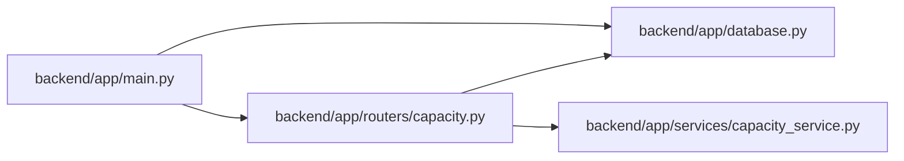

# capacity Module

**Path:** `backend/app/routers/capacity.py`

## Description

Authenticated person availability and bounded capacity views.

## Imports

| Source | Symbols |
|--------|---------|
| `app.database` | `get_db` |
| `app.services.capacity_service` | `CapacityService` |
| `datetime` | `date` |
| `fastapi` | `APIRouter`, `Depends` |
| `pydantic` | `BaseModel`, `Field` |
| `sqlalchemy.ext.asyncio` | `AsyncSession` |
| `typing` | `Annotated` |

## Local dependency map

<!-- Auto-generated local dependency summary. Do not edit by hand. -->

### Internal neighbors

| Direction | Module |
|---|---|
| Inbound | [app_main](../modules/app_main.md) |
| Outbound | [app_database](../modules/app_database.md) |
| Outbound | [capacity_service](../modules/capacity_service.md) |

### External packages

| Language | Used packages | Undeclared packages |
|---|---:|---:|
| python | 3 | 0 |

## Classes

| Class | Kind | Line | Bases / Target | Description |
|-------|------|------|----------------|-------------|
| [Database](../entities/routers_capacity_Database.md) | Type alias | 14 | `Annotated[AsyncSession, Depends(get_db, scope='function')]` | — |
| [CalendarSelection](../entities/CalendarSelection.md) | Pydantic model | 17 | `BaseModel` | — |
| [AbsenceInput](../entities/AbsenceInput.md) | Pydantic model | 22 | `BaseModel` | — |
| [AbsenceUpdate](../entities/AbsenceUpdate.md) | Pydantic model | 27 | `AbsenceInput` | — |

## Functions

| Function | Signature | Decorators | Description |
|----------|-----------|------------|-------------|
| `get_availability` | *(async)* `(profile_id: int, db: Database)` | `@router.get('/team-member-profiles/{profile_id}/availability')` | — |
| `set_availability` | *(async)* `(profile_id: int, data: CalendarSelection, db: Database)` | `@router.put('/team-member-profiles/{profile_id}/availability')` | — |
| `create_absence` | *(async)* `(profile_id: int, data: AbsenceInput, db: Database)` | `@router.post('/team-member-profiles/{profile_id}/absences', status_code=201)` | — |
| `update_absence` | *(async)* `(profile_id: int, absence_id: int, data: AbsenceUpdate, db: Database)` | `@router.put('/team-member-profiles/{profile_id}/absences/{absence_id}')` | — |
| `get_profile_capacity` | *(async)* `(profile_id: int, start: date, end: date, db: Database)` | `@router.get('/team-member-profiles/{profile_id}/capacity')` | — |
