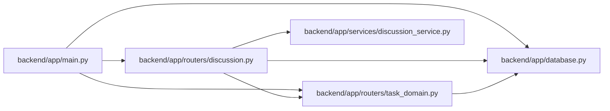

# discussion Module

**Path:** `backend/app/routers/discussion.py`

## Description

Task discussion and a personal inbox, separate from execution evidence.

## Imports

| Source | Symbols |
|--------|---------|
| `app.database` | `get_db` |
| `app.routers.task_domain` | `domain_result` |
| `app.services.discussion_service` | `DiscussionService` |
| `fastapi` | `APIRouter`, `Depends`, `Query` |
| `pydantic` | `BaseModel`, `Field`, `PositiveInt` |
| `sqlalchemy.ext.asyncio` | `AsyncSession` |
| `typing` | `Annotated`, `Literal` |

## Local dependency map

<!-- Auto-generated local dependency summary. Do not edit by hand. -->

### Internal neighbors

| Direction | Module |
|---|---|
| Inbound | [app_main](../modules/app_main.md) |
| Outbound | [app_database](../modules/app_database.md) |
| Outbound | [routers_task_domain](../modules/routers_task_domain.md) |
| Outbound | [discussion_service](../modules/discussion_service.md) |

### External packages

| Language | Used packages | Undeclared packages |
|---|---:|---:|
| python | 3 | 0 |

## Classes

| Class | Kind | Line | Bases / Target | Description |
|-------|------|------|----------------|-------------|
| [DiscussionDatabase](../entities/DiscussionDatabase.md) | Type alias | 14 | `Annotated[AsyncSession, Depends(get_db, scope='function')]` | — |
| [CommentCreate](../entities/CommentCreate.md) | Pydantic model | 17 | `BaseModel` | — |
| [CommentUpdate](../entities/CommentUpdate.md) | Pydantic model | 22 | `CommentCreate` | — |
| [SubscriptionInput](../entities/SubscriptionInput.md) | Pydantic model | 27 | `BaseModel` | — |
| [NotificationRead](../entities/NotificationRead.md) | Pydantic model | 33 | `BaseModel` | — |

## Functions

| Function | Signature | Decorators | Description |
|----------|-----------|------------|-------------|
| `list_task_comments` | *(async)* `(task_id: int, db: DiscussionDatabase, after_id: int = Query(default=0, ge=0), limit: int = Query(default=50, ge=1, le=100))` | `@router.get('/tasks/{task_id}/comments')` | — |
| `task_mention_options` | *(async)* `(task_id: int, db: DiscussionDatabase, q: str = Query(default='', max_length=200), after_id: int = Query(default=0, ge=0), limit: int = Query(default=25, ge=1, le=50))` | `@router.get('/tasks/{task_id}/mention-options')` | — |
| `create_task_comment` | *(async)* `(task_id: int, data: CommentCreate, db: DiscussionDatabase)` | `@router.post('/tasks/{task_id}/comments', status_code=201)` | — |
| `update_task_comment` | *(async)* `(task_id: int, comment_id: int, data: CommentUpdate, db: DiscussionDatabase)` | `@router.put('/tasks/{task_id}/comments/{comment_id}')` | — |
| `task_comment_history` | *(async)* `(task_id: int, comment_id: int, db: DiscussionDatabase, after_version: int = Query(default=0, ge=0), limit: int = Query(default=50, ge=1, le=100))` | `@router.get('/tasks/{task_id}/comments/{comment_id}/history')` | — |
| `get_task_subscription` | *(async)* `(task_id: int, db: DiscussionDatabase)` | `@router.get('/tasks/{task_id}/subscription')` | — |
| `set_task_subscription` | *(async)* `(task_id: int, data: SubscriptionInput, db: DiscussionDatabase)` | `@router.put('/tasks/{task_id}/subscription')` | — |
| `personal_inbox` | *(async)* `(db: DiscussionDatabase, after_id: int = Query(default=0, ge=0), limit: int = Query(default=50, ge=1, le=100))` | `@router.get('/notifications')` | — |
| `personal_notification_deliveries` | *(async)* `(db: DiscussionDatabase, after_id: int = Query(default=0, ge=0), limit: int = Query(default=50, ge=1, le=100))` | `@router.get('/notifications/deliveries')` | — |
| `retry_personal_notification` | *(async)* `(delivery_id: int, db: DiscussionDatabase)` | `@router.post('/notifications/deliveries/{delivery_id}/retry')` | — |
| `mark_notification_read` | *(async)* `(notification_id: int, data: NotificationRead, db: DiscussionDatabase)` | `@router.put('/notifications/{notification_id}')` | — |
