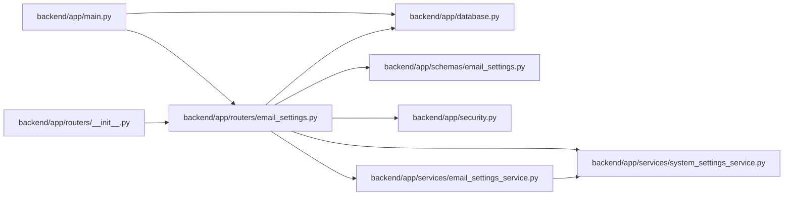

# email_settings Module

**Path:** `backend/app/routers/email_settings.py`

## Description

Email settings API router.

## Imports

| Source | Symbols |
|--------|---------|
| `app.database` | `get_db` |
| `app.schemas.email_settings` | `EmailSettingsUpdate`, `EmailSettingsResponse`, `TestEmailRequest`, `TestEmailResponse` |
| `app.security` | `require_admin_api_key` |
| `app.services.email_settings_service` | `EmailSettingsService` |
| `app.services.system_settings_service` | `RuntimeSettingsError` |
| `fastapi` | `APIRouter`, `Depends`, `HTTPException`, `status` |
| `logging` | `logging` |
| `sqlalchemy.ext.asyncio` | `AsyncSession` |
| `typing` | `Annotated` |

## Local dependency map

<!-- Auto-generated local dependency summary. Do not edit by hand. -->

### Internal neighbors

| Direction | Module |
|---|---|
| Inbound | [app_main](../modules/app_main.md) |
| Inbound | [routers___init__](../modules/routers___init__.md) |
| Outbound | [app_database](../modules/app_database.md) |
| Outbound | [schemas_email_settings](../modules/schemas_email_settings.md) |
| Outbound | [security](../modules/security.md) |
| Outbound | [email_settings_service](../modules/email_settings_service.md) |
| Outbound | [system_settings_service](../modules/system_settings_service.md) |

### External packages

| Language | Used packages | Undeclared packages |
|---|---:|---:|
| python | 2 | 0 |

## Functions

| Function | Signature | Decorators | Description |
|----------|-----------|------------|-------------|
| `_response` | `(settings) -> EmailSettingsResponse` | — | — |
| `get_settings_service` | *(async)* `(db: Annotated[AsyncSession, Depends(get_db, scope='function')]) -> EmailSettingsService` | — | Get email settings service singleton. |
| `get_email_settings` | *(async)* `(service: Annotated[EmailSettingsService, Depends(get_settings_service)])` | `@router.get('/email-settings', response_model=EmailSettingsResponse)` | Get current email settings (password masked). |
| `update_email_settings` | *(async)* `(data: EmailSettingsUpdate, service: Annotated[EmailSettingsService, Depends(get_settings_service)])` | `@router.put('/email-settings', response_model=EmailSettingsResponse)` | Update email settings. |
| `test_email_settings` | *(async)* `(data: TestEmailRequest, service: Annotated[EmailSettingsService, Depends(get_settings_service)])` | `@router.post('/email-settings/test', response_model=TestEmailResponse)` | Send a test email to verify settings. |
