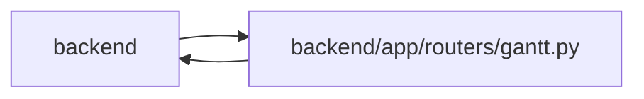

# gantt Module

**Path:** `backend/app/routers/gantt.py`

## Description

Gantt API router.

## Imports

| Source | Symbols |
|--------|---------|
| `app.commands` | `command_transaction`, `lock_iterations` |
| `app.database` | `get_db` |
| `app.models.task` | `Task` |
| `app.routers.tasks` | `apply_batch_update_items` |
| `app.schemas.gantt` | `GanttResponse`, `GanttTask`, `GanttAssignee`, `GanttMilestone`, `ScheduleResult`, `SchedulePreviewRequest`, `SchedulePreviewResponse`, `WorkloadIssue`, `SchedulingDecision`, `ScheduleApplyRequest` |
| `app.schemas.iteration` | `IterationResponse` |
| `app.services.calendar_service` | `CalendarService` |
| `app.services.iteration_service` | `IterationService` |
| `app.services.scheduler_service` | `SchedulerService` |
| `app.services.task_service` | `TaskService`, `TaskVersionConflictError` |
| `app.services.team_service` | `TeamService` |
| `app.services.work_metrics` | `task_signals` |
| `datetime` | `date`, `timedelta` |
| `fastapi` | `APIRouter`, `Depends`, `HTTPException`, `status` |
| `json` | `json` |
| `sqlalchemy.ext.asyncio` | `AsyncSession` |
| `sqlalchemy.orm` | `attributes` |
| `typing` | `Annotated`, `Optional` |

## Local dependency map

<!-- Auto-generated local dependency summary. Do not edit by hand. -->

> Module-level dependencies exceed the generated-diagram limits, so the diagram and table below group them by top-level package. Counts report the number of module neighbors in each package.

### Internal neighbors

| Direction | Module |
|---|---|
| Inbound | `backend` (3) |
| Outbound | `backend` (12) |

### External packages

| Language | Used packages | Undeclared packages |
|---|---:|---:|
| python | 2 | 0 |

> All 15 module neighbor(s) are summarized by package because the module-level view exceeds the 12-node limit.

## Functions

| Function | Signature | Decorators | Description |
|----------|-----------|------------|-------------|
| `get_scheduler_service` | *(async)* `(db: Annotated[AsyncSession, Depends(get_db, scope='function')]) -> SchedulerService` | — | Dependency for scheduler service. |
| `schedule_iteration` | *(async)* `(iteration_id: int, service: Annotated[SchedulerService, Depends(get_scheduler_service)], db: Annotated[AsyncSession, Depends(get_db, scope='function')], data: ScheduleApplyRequest \| None = None)` | `@router.post('/iterations/{iteration_id}/schedule', response_model=ScheduleResult)` | Run automatic scheduling for an iteration. |
| `preview_iteration_schedule` | *(async)* `(iteration_id: int, data: SchedulePreviewRequest, service: Annotated[SchedulerService, Depends(get_scheduler_service)], db: Annotated[AsyncSession, Depends(get_db, scope='function')])` | `@router.post('/iterations/{iteration_id}/schedule/preview', response_model=SchedulePreviewResponse)` | Dry-run sandbox edits through the real scheduler and roll everything back. |
| `get_gantt_data` | *(async)* `(iteration_id: int, db: Annotated[AsyncSession, Depends(get_db, scope='function')])` | `@router.get('/iterations/{iteration_id}/gantt', response_model=GanttResponse)` | Get Gantt chart data for an iteration. |
| `_overdue_task_ids` | `(tasks)` | — | Collect canonical overdue leaves through every level of the returned tree. |
| `_get_calculated_effort` | `(task: Task) -> Optional[float]` | — | Get calculated effort days from the database. |
| `_task_to_gantt` | `(task: Task, iteration_end_date: date, issues: Optional[list[WorkloadIssue]] = None, decisions: Optional[list[SchedulingDecision]] = None, *, calendar_timezone: str = 'UTC') -> Optional[GanttTask]` | — | Convert Task to GanttTask. |
