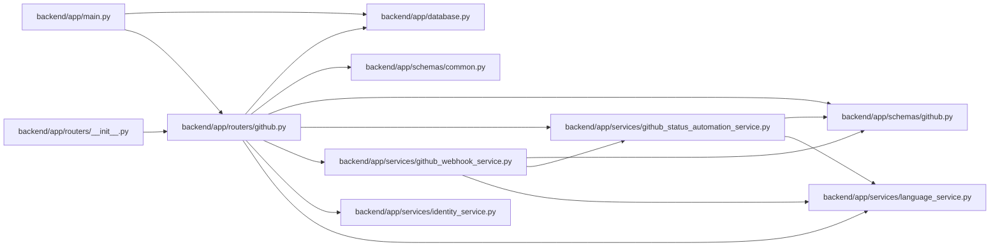

# github Module

**Path:** `backend/app/routers/github.py`

## Description

GitHub webhook API router.

## Imports

| Source | Symbols |
|--------|---------|
| `app.database` | `get_db` |
| `app.schemas.common` | `MessageResponse` |
| `app.schemas.github` | `GitHubStatusAutomationRuleCreate`, `GitHubStatusAutomationRuleResponse`, `GitHubStatusAutomationRuleUpdate`, `GitHubWebhookResponse` |
| `app.services.github_status_automation_service` | `GitHubStatusAutomationService` |
| `app.services.github_webhook_service` | `GitHubWebhookConfigurationError`, `GitHubWebhookPayloadError`, `GitHubWebhookService`, `GitHubWebhookSignatureError` |
| `app.services.identity_service` | `bind_verified_system` |
| `app.services.language_service` | `backend_error_message`, `entity_deleted_message`, `entity_not_found_message`, `resolve_runtime_ui_language` |
| `fastapi` | `APIRouter`, `Body`, `Depends`, `Header`, `HTTPException`, `Request`, `status` |
| `pydantic` | `ValidationError` |
| `sqlalchemy.ext.asyncio` | `AsyncSession` |
| `typing` | `Annotated`, `Optional` |

## Local dependency map

<!-- Auto-generated local dependency summary. Do not edit by hand. -->

### Internal neighbors

| Direction | Module |
|---|---|
| Inbound | [app_main](../modules/app_main.md) |
| Inbound | [routers___init__](../modules/routers___init__.md) |
| Outbound | [app_database](../modules/app_database.md) |
| Outbound | [schemas_common](../modules/schemas_common.md) |
| Outbound | [schemas_github](../modules/schemas_github.md) |
| Outbound | [github_status_automation_service](../modules/github_status_automation_service.md) |
| Outbound | [github_webhook_service](../modules/github_webhook_service.md) |
| Outbound | [identity_service](../modules/identity_service.md) |
| Outbound | [language_service](../modules/language_service.md) |

### External packages

| Language | Used packages | Undeclared packages |
|---|---:|---:|
| python | 3 | 0 |

## Functions

| Function | Signature | Decorators | Description |
|----------|-----------|------------|-------------|
| `get_github_webhook_service` | *(async)* `(db: Annotated[AsyncSession, Depends(get_db, scope='function')]) -> GitHubWebhookService` | — | Dependency for GitHub webhook processing. |
| `get_github_status_automation_service` | *(async)* `(db: Annotated[AsyncSession, Depends(get_db, scope='function')]) -> GitHubStatusAutomationService` | — | Dependency for GitHub status automation rule management. |
| `list_github_status_automation_rules` | *(async)* `(service: Annotated[GitHubStatusAutomationService, Depends(get_github_status_automation_service)])` | `@router.get('/github/status-automation-rules', response_model=list[GitHubStatusAutomationRuleResponse])` | List GitHub status automation rules. |
| `create_github_status_automation_rule` | *(async)* `(raw_data: Annotated[dict, Body(...)], service: Annotated[GitHubStatusAutomationService, Depends(get_github_status_automation_service)])` | `@router.post('/github/status-automation-rules', response_model=GitHubStatusAutomationRuleResponse, status_code=status.HTTP_201_CREATED)` | Create a GitHub status automation rule. |
| `update_github_status_automation_rule` | *(async)* `(rule_id: int, raw_data: Annotated[dict, Body(...)], service: Annotated[GitHubStatusAutomationService, Depends(get_github_status_automation_service)])` | `@router.put('/github/status-automation-rules/{rule_id}', response_model=GitHubStatusAutomationRuleResponse)` | Update a GitHub status automation rule. |
| `delete_github_status_automation_rule` | *(async)* `(rule_id: int, service: Annotated[GitHubStatusAutomationService, Depends(get_github_status_automation_service)])` | `@router.delete('/github/status-automation-rules/{rule_id}', response_model=MessageResponse)` | Delete a GitHub status automation rule. |
| `receive_github_webhook` | *(async)* `(request: Request, service: Annotated[GitHubWebhookService, Depends(get_github_webhook_service)], github_event: Annotated[Optional[str], Header(alias='X-GitHub-Event')] = None, github_delivery: Annotated[Optional[str], Header(alias='X-GitHub-Delivery')] = None, github_signature: Annotated[Optional[str], Header(alias='X-Hub-Signature-256')] = None)` | `@router.post('/github/webhooks', response_model=GitHubWebhookResponse)` | Receive and process a signed GitHub webhook delivery. |
